## 1. 项目搭建
- 新建项目 `exchange-wallet-service`
- 目录如下：
```
├── cmd                 主程序入口、命令行程序框架
├── common              通用工具库
├── config              配置文件管理代码
├── database            数据库代码
├── flags               环境变量管理代码
├── migrations          数据库迁移
├── notifier            回调通知管理
├── protobuf            grpc 接口及生成代码
├── rpcclient           grpc 连接客户端
├── services            grpc 服务管理及接口实现
├── sh                  shell 命令
├── worker              核心工作代码（充值、提现、归集、热转冷）
├── exchange.go         主程序生命周期管理
├── Makefile  shell     命令管理
├── devops.md           开发步骤
├── go.mod              依赖管理
├── README.md         
  ```
## 2. 控制台应用整合
- `main.go`
```
func main() {
	log.SetDefault(log.NewLogger(log.NewTerminalHandlerWithLevel(os.Stdout, log.LevelInfo, true)))
	app := NewCli(GitCommit, GitData)
	ctx := opio.WithInterruptBlocker(context.Background())
	if err := app.RunContext(ctx, os.Args); err != nil {
		log.Error("Application failed")
		os.Exit(1)
	}
}
```
- `cli.go`
```
func NewCli(GitCommit string, GitData string) *cli.App {
	//flags := flags2.Flags
	return &cli.App{
		Version:              params.VersionWithCommit(GitCommit, GitData),
		Description:          "An exchange wallet scanner services with rpc and rest api server",
		EnableBashCompletion: true,
		Commands: []*cli.Command{
			{
				Name:        "version",
				Description: "Show project version",
				Action: func(ctx *cli.Context) error {
					cli.ShowVersion(ctx)
					return nil
				},
			},
		},
	}
}
```

## 3. 数据库设计、gorm 搭建
- `Business(businessId,notifyUrl...)`: 注册商户表
- `Blocks(hash,parentHash,number...)`: 区块信息表
- `ReorgBlocks(hash,parentHash,number)`: 回滚区块表（回滚时处理交易使用）
- `Address(address,addressType,publicKey...)`: 钱包地址表
- `Balance(address,tokenAddress,balance,lockBalance...)`: 地址余额表
- `Deposit(from,to,amount,confirms,blockHash...)`: 充值表
- `Withdraw(from,to,amount,blockHash...)`: 提现表
- `Internals(from,to,amount,blockHash...)`: 内部交易表（归集、热转冷、冷转热）
- `Transactions(from,to,amount,fee,hash...)`: 交易流水表
- `Token(tokenAddress,decimals,collectAmount...)`: token合约表

- 数据库迁移脚本：`migrations` 文件夹中 
- 执行数据库迁移：执行 `make` 编译程序，然后 `./exchange-wallet-service migrate`
- 实现每一个表对应结构体、新增表、增删改查接口
## 4. rpc 搭建
- 编写 `exchange-wallet.proto`文件，定义消息和接口
- `make protogo` 生成对应的 protobuf 代码
- 搭建对接 `chains-union-rpc` 的 `client`(需先把`chains-union-rpc` 的 `protobuf` 代码复制过来)
- 搭建 `services`，新建包含 `db、rpcclient`、的 `grpc`，对接进 `urfave/cli` 的程序里，启动 `grpc` 服务
- 编写捕获 `panic` 的拦截器，传入给 grpc 处理
- 此程序提供的接口写在 `handler.go`

## 5. rpc 接口实现
- **业务方注册**：
    1. 业务方携带自己的 `requestId` 进行注册，系统会根据 `requestId` 为其生成独立的 `address`、`balance`、`transactions`、`deposits`、`withdraw`、`internal`、`tokens` 表
    2. 注册成功后，其所有业务都需要携带 `requestId` 进行请求，数据独立在其自己的表中。
    ```
  	BusinessRegister(context.Context, *BusinessRegisterRequest) (*BusinessRegisterResponse, error)
   ```
- **批量导出地址**：
    1. 业务方通过 “`signature-machine`” 项目（项目方自己部署，自己掌控私钥和签名流程）批量生成公钥，将公钥传入此接口，批量获取地址。
    2. 此接口中，会根据用户方传入的地址类型，保存该地址信息到 `address_{requestId}` 表中,并初始化 `balances`
    ```
  	ExportAddressesByPublicKeys(context.Context, *ExportAddressesRequest) (*ExportAddressesResponse, error)
  ```
- **构建未签名交易**：
    1. 在此接口中，业务方传入关键参数：`from`、`to`、`amount`、`chainId` 等信息，调用该接口。该接口会调用 “`chains-union-rpc`” 项目去获取地址的 `nonce`、`gasFee` 等。
    2. 然后构建 `EIP-1159` 的交易，调用 “`chains-union-rpc`” 项目去构建交易，返回 `16` 进制的未签名交易 `messageHash`（`32` 字节）、将交易信息保存在表中。返回 `messageHash` 和请求的 `transactionId`
    ```
      BuildUnSignTransaction(context.Context, *UnSignTransactionRequest) (*UnSignTransactionResponse, error)
  ```
- **构建已签名交易**：
    1. 项目方持有上述的未签名交易的 `messageHash`，调用 “`signature-machine`” 使用该交易对应的 `from` 地址私钥进行对此 `messageHash` 签名，返回 `signature` （`65` 字节） 信息
    2. 项目方拿到 `signature`、`transactionId`。 由 `transactionId` 从表中查出这笔交易，然后重新构造出来相同交易。调用 “`chains-union-rpc`” 的构建已签名接口，使用 `signature` 和 原交易信息发起调用 `BuildSignedTransaction`接口。
    3. 在“`chains-union-rpc`”中，会将 `signature` 拆分出 `r、s、v` 值和原交易组合起来，格式化返回一个已签名的交易（`16` 进制，`base64` 编码）
    4. 在拿到这个已签名交易的 `16` 进制数据后，即可调用 “`chains-union-rpc`” 里面的 `sendTx` 接口，将这笔交易公布到 `rpc` 网络中即可
    ```
  	BuildSignedTransaction(context.Context, *SignedTransactionRequest) (*SignedTransactionResponse, error)
  ```
- **设置合约地址**：
     1. 传入 ERC20 合约地址，作为合约项目白名单，存 tokens_{requestId} 表, 后续接入代币处理用。
    ```
  	SetTokenAddress(context.Context, *SetTokenAddressRequest) (*SetTokenAddressResponse, error)
  ```

- **联调** `exchange-wallet-service`、`signature-machine`、 `chains-union-rpc` **三个项目**

交易流程图

  1. exchange-wallet-service 业务方注册
  
  
  

  2. signature-machine 批量公钥生成

  
  

  3. exchange-wallet-service 公钥转地址

  
  

  4. 转资金进这个地址

  

  5. exchange-wallet-service 构建未签名交易
  
  
  

  6. signature-machine 中签名操作
  
  
  

  7. exchange-wallet-service 构建已签名交易
  
  
  

  8. chains-union-rpc 发送出去交易
  
  
  

  9. holesky 区块浏览器中查看这笔交易
  
  

## 6. 扫链同步器搭建
流程图


  - `worker` 下，建立 `synchronizer.go` 文件
    核心数据结构为一个管道，用于存放每个项目方的需要处理的批量交易
```go
      核心管道，存放一批次的交易，map 中的 key 为业务方 id*/
      buinessChannels chan map[string]*BatchTransactions
```

  - 在 cli.go 中集成启动扫链同步的任务
```go
    {
        Name:        "work",
        Flags:       flags,
        Description: "Run rpc scanner wallet chain node",
        Action:      cliapp.LifecycleCmd(runAllWorker),
    },
```
  - 使用定时任务启动 扫链同步器
```go
    	/*定时任务*/
	syncer.worker = clock.NewLoopFn(clock.SystemClock, syncer.tick, func() error {
		log.Info("shutting down synchronizer produce...")
		close(syncer.businessChannels)
		return nil
	}, syncer.loopInterval)
```
  - 调用封装的方法，通过 chains-union-rpc 接口批量获取区块头，并且判断链上是否出现回滚情况。
    如果出现某个区块的 `parentHash` 不等于上一个区块的 `hash` 则认为出现链回滚（重组的情况），
    则同步器会空转，无法获取到新的一批区块，直到重组区块被处理完成。（通过 `lastTraversalBlockHeader` 来进行标记处理）
```go
  /*headers 只有一个数据的情况（边界情况）：
  元素的 parentHash != lastTraversedHeader 的 Hash
  则说明发生链重组-->触发 fallback*/
  if len(headers) == 1 && f.lastTraversedHeader != nil && headers[0].ParentHash != f.lastTraversedHeader.Hash {
      log.Warn("lastTraversedHeader and header zero: parentHash and hash", "parentHash", headers[0].ParentHash, "Hash", f.lastTraversedHeader.Hash)
      return nil, blockHeader, true, ErrBlockFallBack
  }
  /*如果发现第 i 个 header 与 i-1 个不连续（parentHash 不匹配），
  也说明链断开或被重组。*/
  if len(headers) > 1 && headers[i-1].Hash != headers[i].ParentHash {
      log.Warn("headers[i-1] nad headers[i] parentHash and hash", "parentHash", headers[i].ParentHash, "Hash", headers[i-1].Hash)
      return nil, blockHeader, true, ErrBlockFallBack
		}
```
  - 区块头批量扫描完成后，即可进入交易解析的过程。
    1. 循环遍历区块头列表，每个区块获取这个区块内的交易
    2. 按照项目方匹配这个区块内的交易，匹配规则如下：
    ```go
    /*
      * 充值：from 地址为外部地址，to 地址为用户地址
      * 提现：from 地址为热钱包地址，to 地址为外部地址
      * 归集：from 地址为用户地址，to 地址为热钱包地址（默认热钱包地址为归集地址）
      * 热转冷：from 地址为热钱包地址，to 地址为冷钱包地址
      * 冷转热：from 地址为冷钱包地址，to 地址为热钱包地址
	    */
      ```
    3. 标记完交易后，所有项目方的筛选后的交易都放到一个核心的交易管道中，供后续的充值、提现、归集、热转冷、冷转热任务所使用。
    ```go
        /*核心管道，存放一批次的交易，map 中的 key 为业务方 id*/
        businessChannels chan map[string]*BatchTransactions
    ```
    4. 交易推送完后，还需要对所解析的区块进行存库，存储到 `blocks` 表中。然后清理上一批次的交易 `headers` 列表，使同步器能够进行下一次同步区块。
    ```go
        /*处理这一批次区块*/
        err := syncer.processBatch(syncer.headers)
        /*成功则清空 headers，进入到下一轮*/
        if err == nil {
            syncer.headers = nil
        }
    ```
### 扫块测试
- 启动扫链同步器服务


## 7. 交易发现器、充值业务实现
流程图


充值业务泳道图


  在之前的开发步骤中，我们实现了交易的同步器，负责将区块链上的区块扫描下来，并解析交易筛选出
  与我们交易所内所有项目方有关的地址，放到一个同步管道中。（属于生产者的角色）
  在这步的开发中，我们将实现一个消费者角色，也就是交易的发现器。
  在这个发现器中，我们将实现充值、提现、归集、转冷、转热交易的链上发现处理，
  并且完成充值确认位的处理，交易流水的入库处理。
  
  1. 协程异步启动交易发现器
  ```go
	/*协程异步处理任务*/
	f.tasks.Go(func() error {
		log.Info("handle deposit task start")
		for batch := range f.BaseSynchronizer.businessChannels {
			log.Info("deposit business channel", "batch length", len(batch))

			/* 实现所有交易处理*/
			if err := f.handleBatch(batch); err != nil {
				log.Info("failed to handle batch, stopping L2 Synchronizer:", "err", err)
				return fmt.Errorf("failed to handle batch, stopping L2 Synchronizer: %w", err)
			}
		}
		return nil
	})
  ```
  2. 消费 businessChannel 中的交易
    businessChannel 中一个map存放的是所有项目方的这批次的交易列表。将其按项目方取出来，
    然后分别对每一笔交易进行入库处理，需要处理的任务如下：

  ```go
    /*
    处理所有推送过来交易（一批次，所有有关项目方的都在这个 map 中）
    充值：库中原来没有，入库、更新余额。库中的充值更新确认位
    提现：库中原来有记录（项目方提交的），更新状态为已发现
    归集：库中原来有记录（项目方提交的），更新状态为已发现
    热转冷、冷转热：库中原来有记录（项目方提交的），更新状态为已发现
    交易流水：入库 transaction 表
    */
   ```

### 交易发现器测试
1. 启动之前余额


2. 转入资金


3. 运行 ./exchange-wallet-service work


4. 启动之后余额（等待确认位之后（10 个块））


## 8. 提现业务实现
在提现任务中，我们需要做的事情比较简单（因为在发现器中，我们已经将提现的发现流程处理了）
提现的任务主要分两步：
1. 发送提现交易
   1. 首先，我们需要使用热钱包地址构建一笔提现交易，form 地址为热钱包地址，to 地址为外部地址。调用之前 RPC 服务写好的构建未签名交易、签名机签名、构造已签名交易（前面的步骤已实现）
   2. 因为在构完已签名交易之后，我们会把这笔已签名交易存储到提现表中，其中包含已签名交易的完整的交易内容。所以，在这一步中，我们只需要使用协程启动一个定时任务，在定时任务中，
       将这笔交易从数据库中查询出来，然后调用接口发送到区块链网络，同时更新余额表和提现表即可。
    ```
   /*启动定时任务发送提现记录*/
    func (w *Withdraw) Start() error {
    log.Info("starting withdraw....")
    w.tasks.Go(func() error {
    for {
    select {
    case <-w.ticker.C:
    /*定时发送提现交易*/
    businessList, err := w.db.Business.QueryBusinessList()
    if err != nil {
    log.Error("failed to query business list", "err", err)
    continue
    }
    for _, business := range businessList {
    /*每个项目方处理已签名但未发出的交易*/
    unSendTransactionList, err := w.db.Withdraws.UnSendWithdrawsList(business.BusinessUid)
    if err != nil {
    log.Error("failed to unsend transaction", "err", err)
    continue
    }
    if unSendTransactionList == nil || len(unSendTransactionList) == 0 {
    log.Error("no withdraw transaction found", "businessId", business.BusinessUid)
    continue
    }
    
                        var balanceList []*database.Balances
    
                        for _, unSendTransaction := range unSendTransactionList {
                            /*每一笔提现交易发出去*/
                            txHash, err := w.rpcClient.SendTx(unSendTransaction.TxSignHex)
                            if err != nil {
                                log.Error("failed to send transaction", "err", err)
                                continue
                            } else {
                                /*成功更新余额*/
                                balanceItem := &database.Balances{
                                    TokenAddress: unSendTransaction.TokenAddress,
                                    Address:      unSendTransaction.FromAddress,
                                    /*发出提现，balance-，lockBalance+，*/
                                    LockBalance: unSendTransaction.Amount,
                                }
                                balanceList = append(balanceList, balanceItem)
                                unSendTransaction.TxHash = common.HexToHash(txHash)
                                /*已广播，未确认*/
                                unSendTransaction.Status = constant.TxStatusBroadcasted
                            }
                        }
    
                        retryStrategy := &retry.ExponentialStrategy{Min: 1000, Max: 20_000, MaxJitter: 250}
                        /*数据库重试*/
                        if _, err := retry.Do[interface{}](w.resourceCtx, 10, retryStrategy, func() (interface{}, error) {
                            /*事务*/
                            if err := w.db.Gorm.Transaction(func(tx *gorm.DB) error {
                                /*更新余额表*/
                                if len(balanceList) > 0 {
                                    log.Info("update withdraw balance transaction", "totalTx", len(balanceList))
                                    if err := w.db.Balances.UpdateBalanceListByTwoAddress(business.BusinessUid, balanceList); err != nil {
                                        log.Error("failed to update withdraw balance transaction", "err", err)
                                        return err
                                    }
                                }
    
                                /*更新提现表*/
                                if len(unSendTransactionList) > 0 {
                                    err = w.db.Withdraws.UpdateWithdrawListById(business.BusinessUid, unSendTransactionList)
                                    if err != nil {
                                        log.Error("update withdraw status fail", "err", err)
                                        return err
                                    }
                                }
                                return nil
                            }); err != nil {
                                return err, nil
                            }
                            return nil, nil
                        }); err != nil {
                            return err
                        }
                    }
                case <-w.resourceCtx.Done():
                    /*提现任务终止*/
                    log.Info("stopping withdraw in worker")
                    return nil
                }
            }
        })
        return nil
    }
    ```
2. 同步、发现提现交易（这一步已经在交易发现器中处理完毕，此处无需处理）

### 提现测试

1. 签名机生成秘钥对
   生成一个热钱包地址去使用

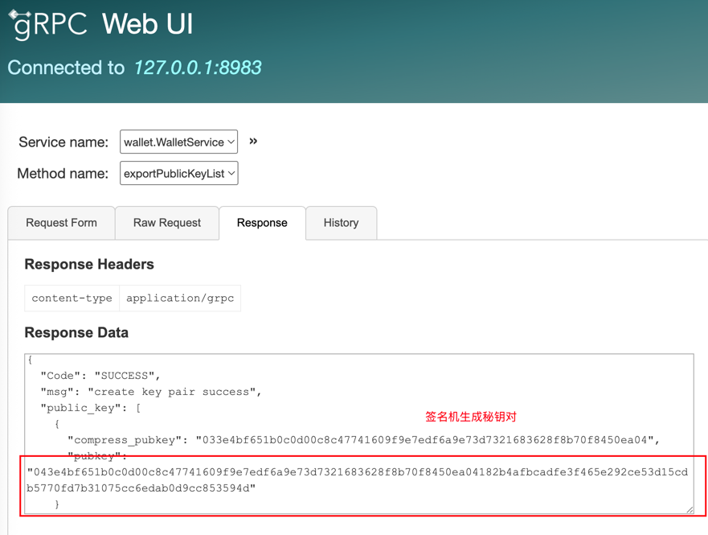

2. 注册进钱包业务
   将这个热钱包地址注册进交易所业务层中

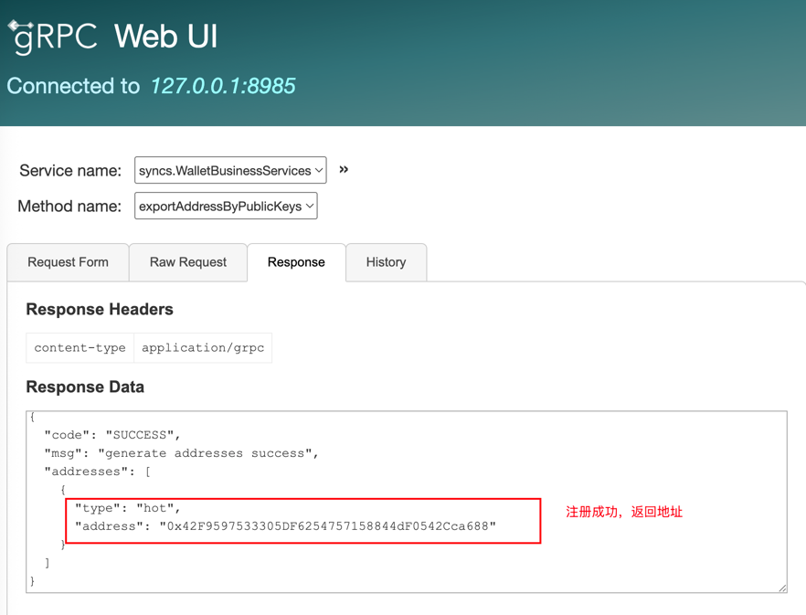

3. 转钱给热钱包地址
   先给这个热钱包地址一点资金，作为提现所用

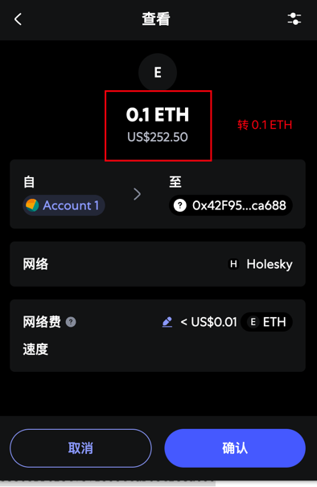

4. 手动修改数据库余额（模拟归集后热钱包有钱）
   因为不是在交易所钱包业务中归集的，所以需要手动改一下库用于测试

   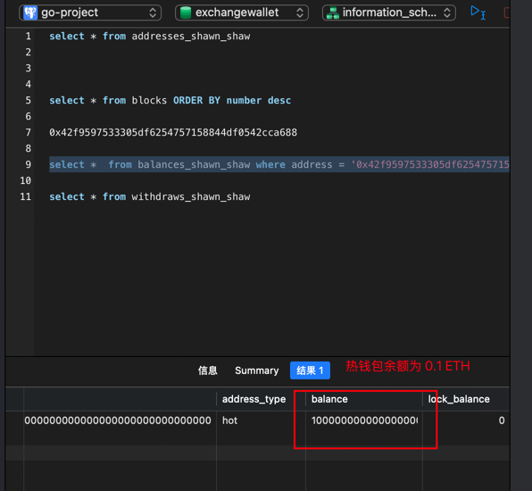

5. 构建一笔未签名交易
   调用交易所钱包业务的构建未签名交易接口

   

   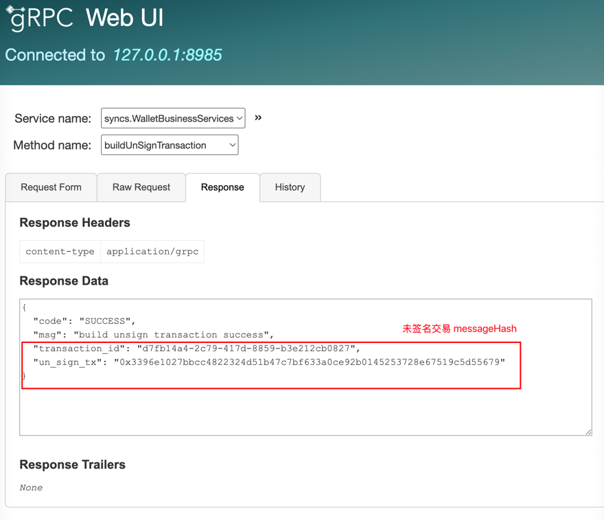

6. 签名这笔交易
   将未签名交易的 messageHash 交给签名机离线签名

   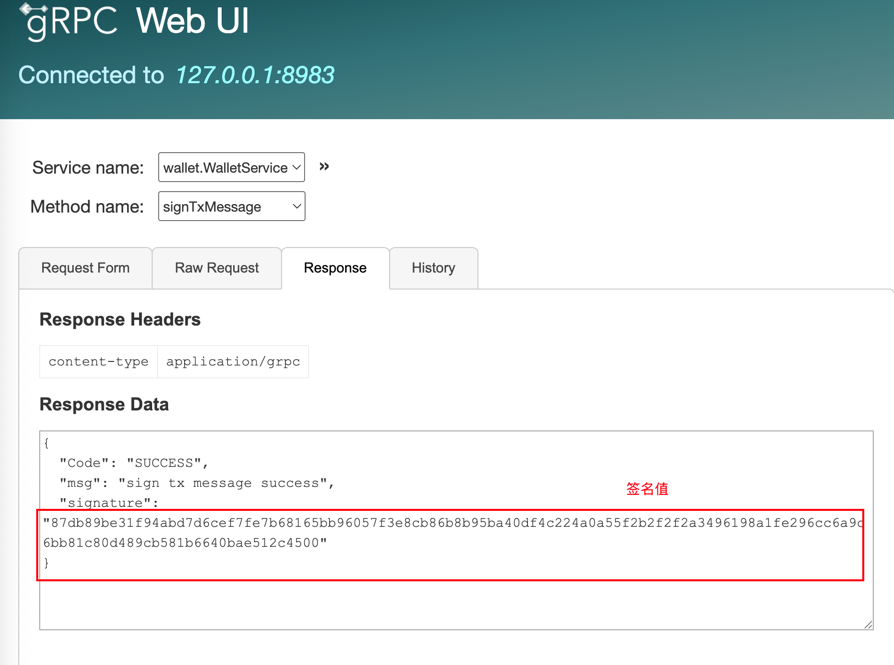

7. 检查余额、提现记录
   先检查下交易还未发送之前的热钱包余额和提现记录情况，方便后续发出交易后对比

   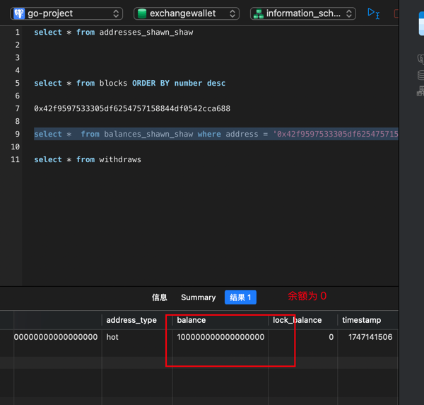
    （此处图片有笔误，应该是 0.1 ETH）

   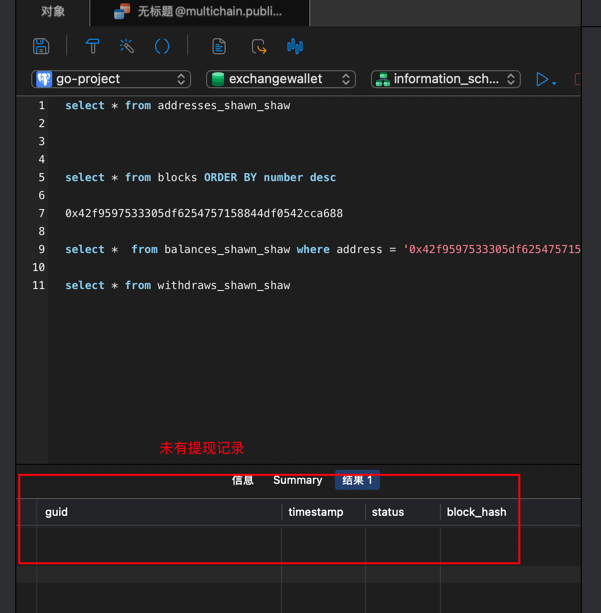

8. 构建已签名交易，等待发起
   调用钱包层已经签名交易的接口，钱包层收到后，定时任务会发现这笔交易已签名，调用发送交易发送到区块链
   网络上（交易状态为已广播）然后交易同步器、发现器发现这笔提现交易后，即修改交易状态为（完成）

   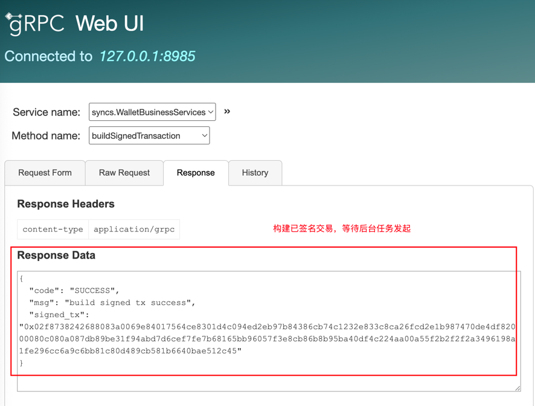

9. 等待交易发出、扫块发现
   检查数据库中提现记录，发现提现交易已完成。再检查余额记录，发现 0.02 ETH 已被成功扣除。

   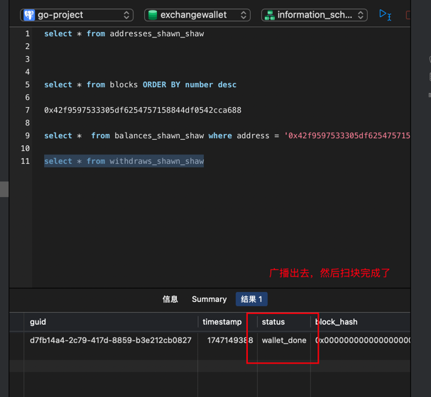

   


## 9. 归集、热转冷、冷转热业务实现

归集业务、热转冷业务、冷转热业务在我们交易所中，可以将其归为一大类。因为这类的交易，
只需要交易所掌控的地址之间进行交互集合，无须与外部地址进行交易（充值、提现需要和外部地址进行交互）
所以，我们称这类业务为 Internal 内部交易。
下面是这三种交易的区别：

归集：from 地址为用户地址，to 地址为热钱包地址（归集地址）

热转冷： from 地址为热钱包地址，to 地址为冷钱包地址

冷转热：from 地址为冷钱包地址，to 地址为热钱包地址


### 交易所内归集交易的步骤

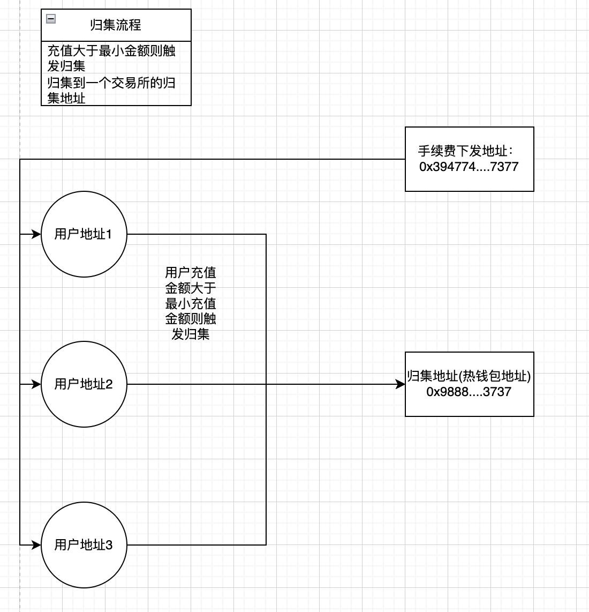

在交易所内，为了保证资金的安全，降低资金被盗的风险（热钱包地址安全级别更高），以及降低对账、提现等业务的难度。
通常来讲，会做一个资金的归集过程，也就是说：交易所会采取一系列的策略去将大量的用户地址的资金归集到一个归集地址上面去。
一般来说，归集的触发会有一个 “用户最小充值资金” 的概念，如果说用户充值金额很小， 
交易所有可能考虑到手续费的磨损、归集频繁程度，可能不会对小额充值进行归集。

归集业务有几种实现方式：

1. 批量归集
对于某些链，原生支持批量归集的操作。例如 UTXO 模型的链（如比特币），支持多个 UTXO 的输入，单个归集地址的输出。
这样就能原生实现链上的批量归集业务了。

2. 单笔归集
但是对于某些链，比如说非合约地址作为用户地址的以太坊，并不是原生支持批量转账的（Pectra 升级之前，升级之后可以批量转账），
在这种情况下，交易所对这种链的归集只能对进行每个用户地址进行单笔交易的归集。


- 提问：归集业务中，如果某个用户地址没有主币，那手续费谁来付？
一般来说，有两种情况：

    1. 一种情况是这个链具有原生支持 gas 代付的能力（例如 solana），那么，这个手续费只需要交易所在进行归集操作时，指定一个代付账号地址即可。
    
    2. 另一种情况是这个链不原生支持 gas 代付的能力（例如 Pectra 升级之前的以太坊），那么，
       这个手续费必须先由交易所的某个地址下发到需要归集的用户地址再进行归集的操作。

- 提问：某些链不需要归集，是怎么实现的？

某些链，可以在交易的时候携带 Tag（memo），这样的链无需进行归集的操作。因为：

1. 用户充值时候，将交易所的用户 id 填写到这个 Tag（memo）字段中。

2. 充值的资金直接打到交易所的热钱包地址中，无需给用户分配用户地址。

3. 交易所扫链发现这笔交易，将充值的资金分配给这个交易所的用户 id 即可。

### 内部交易的整体流程图

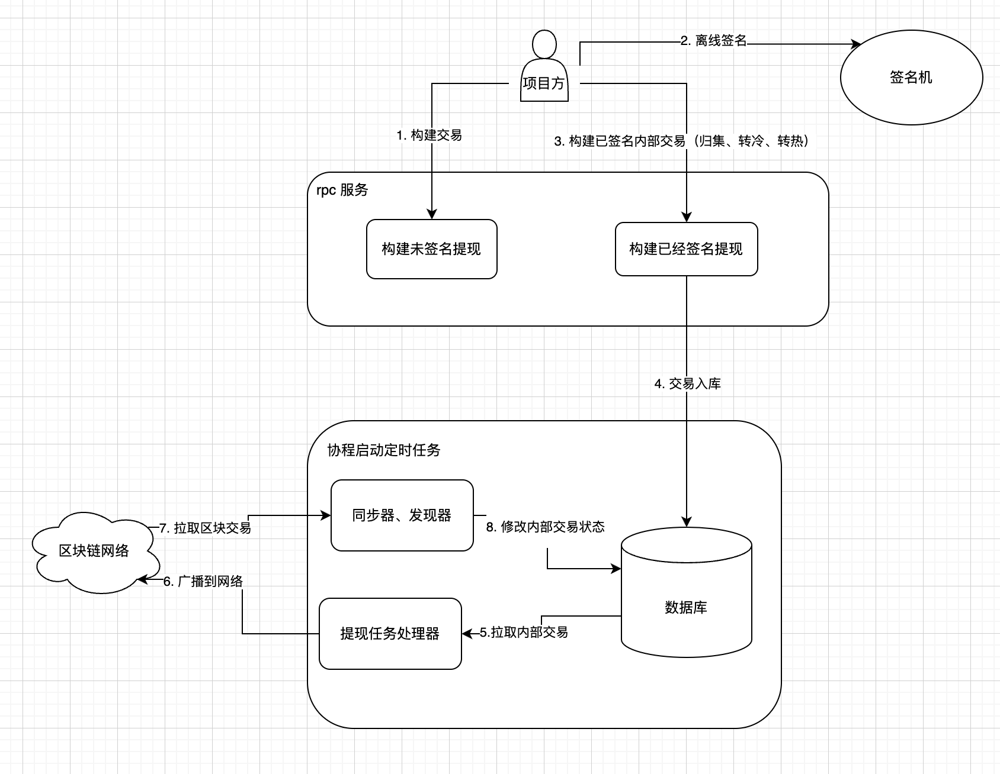

详细解释见下面交易所交易的实现

### 内部交易的实现
内部交易的实现实际上和我们的提现业务非常类似，都是由项目方发起，
且都是需要启动定时任务去扫描数据库中的已签名交易，发送到区块链网络中。
下面我来介绍下详细的步骤：

1. 项目方调用钱包业务层，生成未签名交易，获得 transactionId 和 32 字节的 messageHash

2. 项目方使用 messageHash 调用自己部署的签名机，签名这笔交易。

3. 项目方使用 transactionId 和 signature 去钱包层构建已签名交易。（钱包层会保存到数据库中）

4. 钱包层启动定时任务，扫描数据库中的内部交易（归集、转冷、转热），发送到区块链网络中，交易状态为已广播。

5. 钱包层的扫链同步器、交易发现器发现这笔内部交易，更新交易的状态为完成。

```go
/*
启动内部交易处理任务
处理归集、热转冷、冷转热
交易的发送到链上，更新库、余额
*/
func (in *Internal) Start() error {
	log.Info("starting internal worker.......")
	in.tasks.Go(func() error {
		for {
			select {
			case <-in.ticker.C:
				log.Info("starting internal worker...")
				businessList, err := in.db.Business.QueryBusinessList()
				if err != nil {
					log.Error("failed to query business list", "err", err)
					continue
				}
				for _, business := range businessList {
					/*分项目方处理*/
					unSendTransactionList, err := in.db.Internals.UnSendInternalsList(business.BusinessUid)
					if err != nil {
						log.Error("failed to query unsend internals list", "err", err)
						continue
					}
					if unSendTransactionList == nil || len(unSendTransactionList) <= 0 {
						log.Error("failed to query unsend internals list", "err", err)
						continue
					}

					var balanceList []*database.Balances

					for _, unSendTransaction := range unSendTransactionList {
						/*分单笔交易发送*/
						txHash, err := in.rpcClient.SendTx(unSendTransaction.TxSignHex)
						if err != nil {
							log.Error("failed to send internal transaction", "err", err)
							continue
						} else {
							/*发送成功, 处理from 地址余额*/
							balanceItem := &database.Balances{
								TokenAddress: unSendTransaction.TokenAddress,
								Address:      unSendTransaction.FromAddress,
								LockBalance:  unSendTransaction.Amount,
							}
							/*todo 缺少 to 地址的余额处理？*/

							balanceList = append(balanceList, balanceItem)

							unSendTransaction.TxHash = common.HexToHash(txHash)
							unSendTransaction.Status = constant.TxStatusBroadcasted
						}
					}
					retryStrategy := &retry.ExponentialStrategy{Min: 1000, Max: 20_000, MaxJitter: 250}
					if _, err := retry.Do[interface{}](in.resourceCtx, 10, retryStrategy, func() (interface{}, error) {
						if err := in.db.Gorm.Transaction(func(tx *gorm.DB) error {
							/*处理内部交易余额*/
							if len(balanceList) > 0 {
								log.Info("Update address balance", "totalTx", len(balanceList))
								if err := in.db.Balances.UpdateBalanceListByTwoAddress(business.BusinessUid, balanceList); err != nil {
									log.Error("Update address balance fail", "err", err)
									return err
								}

							}
							/*保存内部交易状态*/
							if len(unSendTransactionList) > 0 {
								err = in.db.Internals.UpdateInternalListById(business.BusinessUid, unSendTransactionList)
								if err != nil {
									log.Error("update internals status fail", "err", err)
									return err
								}
							}
							return nil
						}); err != nil {
							log.Error("unable to persist batch", "err", err)
							return nil, err
						}
						return nil, nil
					}); err != nil {
						return err
					}
				}

			case <-in.resourceCtx.Done():
				log.Info("worker is shutting down")
				return nil
			}
		}
	})
	return nil
}
```

### 归集测试

1. 构建未签名交易

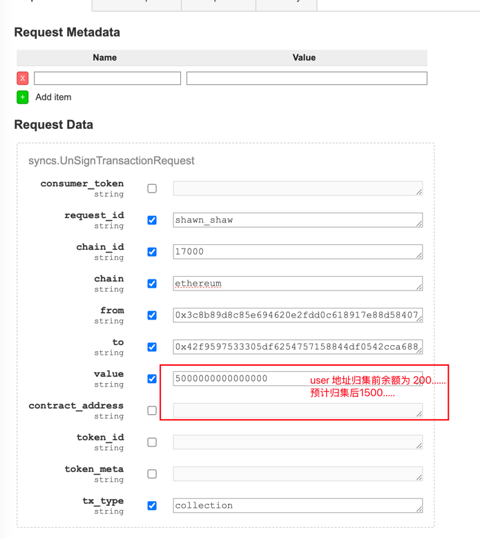

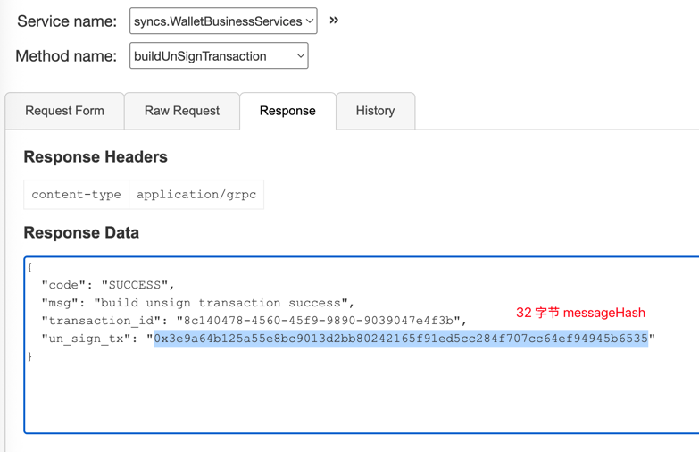

2. 签名机签名

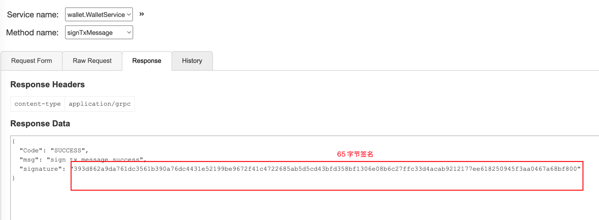

3. 构建已签名交易

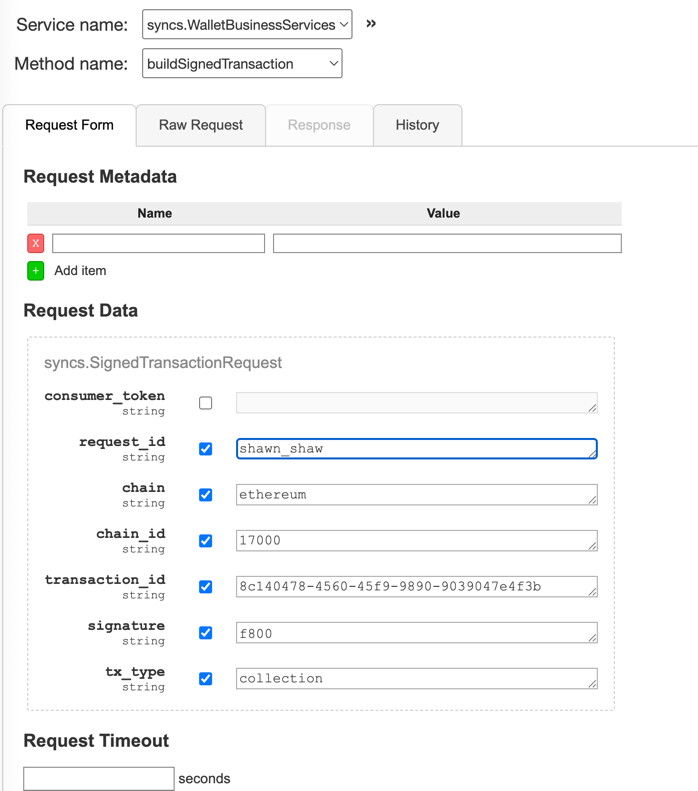

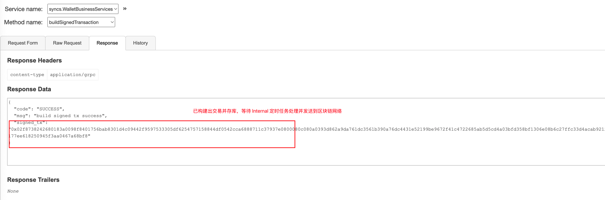

4. 归集前余额

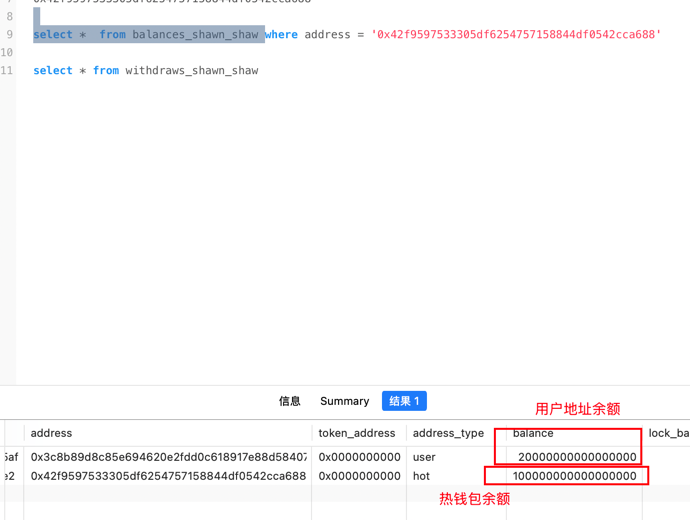

5. 启动同步器、发现器、内部交易定时任务后查看余额变化

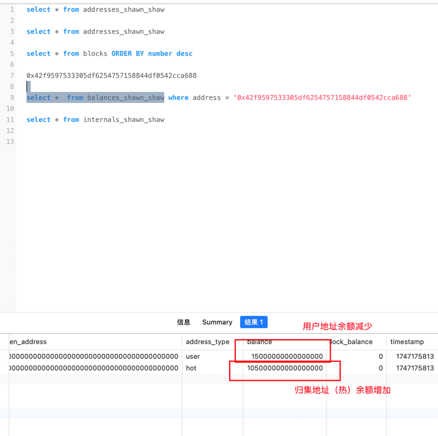

### 热转冷测试
1. 交易构建和签名过程和之前的测试一样，这里省略...

2. 热转冷前的余额

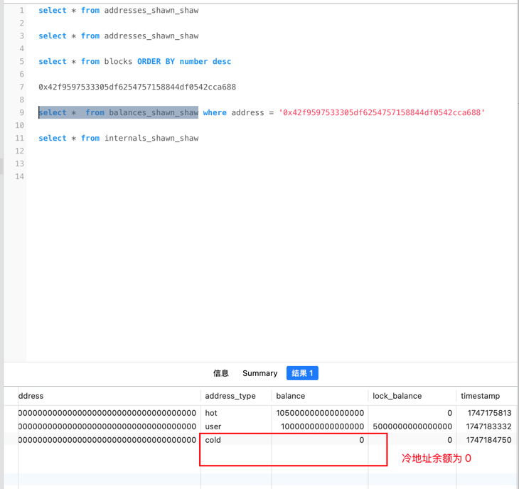

3. 热转冷后的余额

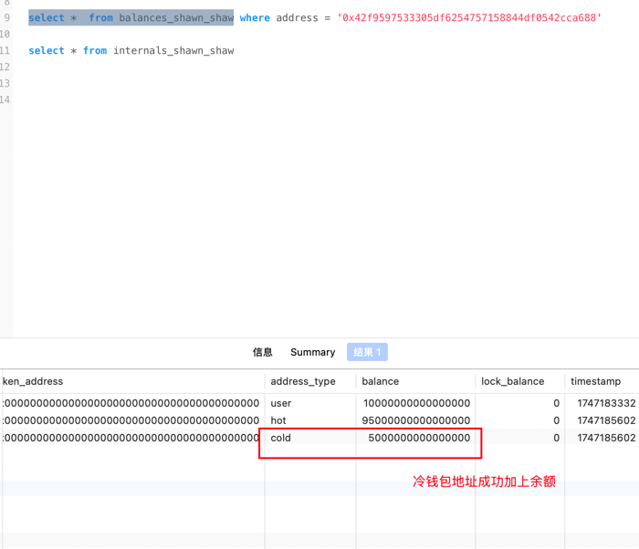

### 冷转热测试
1. 交易构建和签名过程和之前的测试一样，这里省略...

2. 冷转热之前的余额

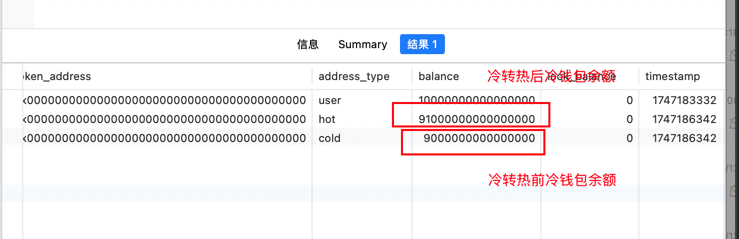

3. 冷转热之后的余额

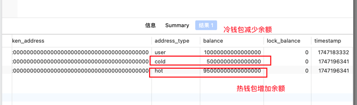

## 11. 回滚业务实现

## 12. 通知业务实现

