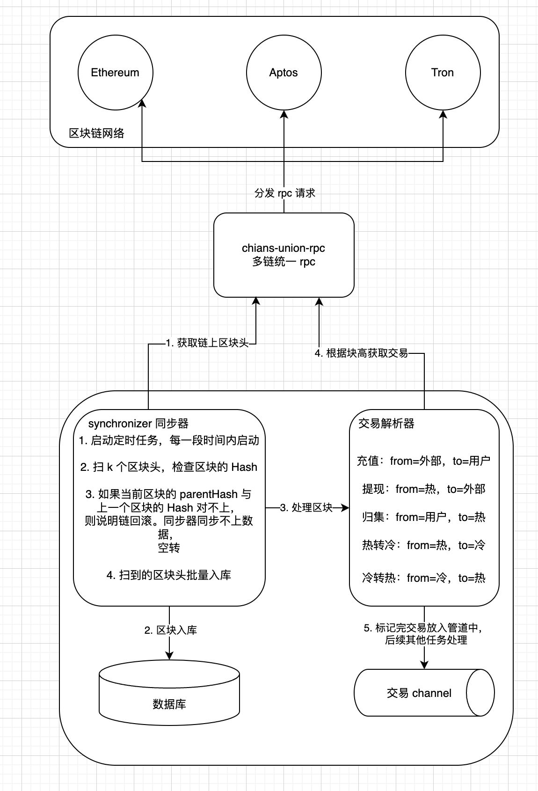
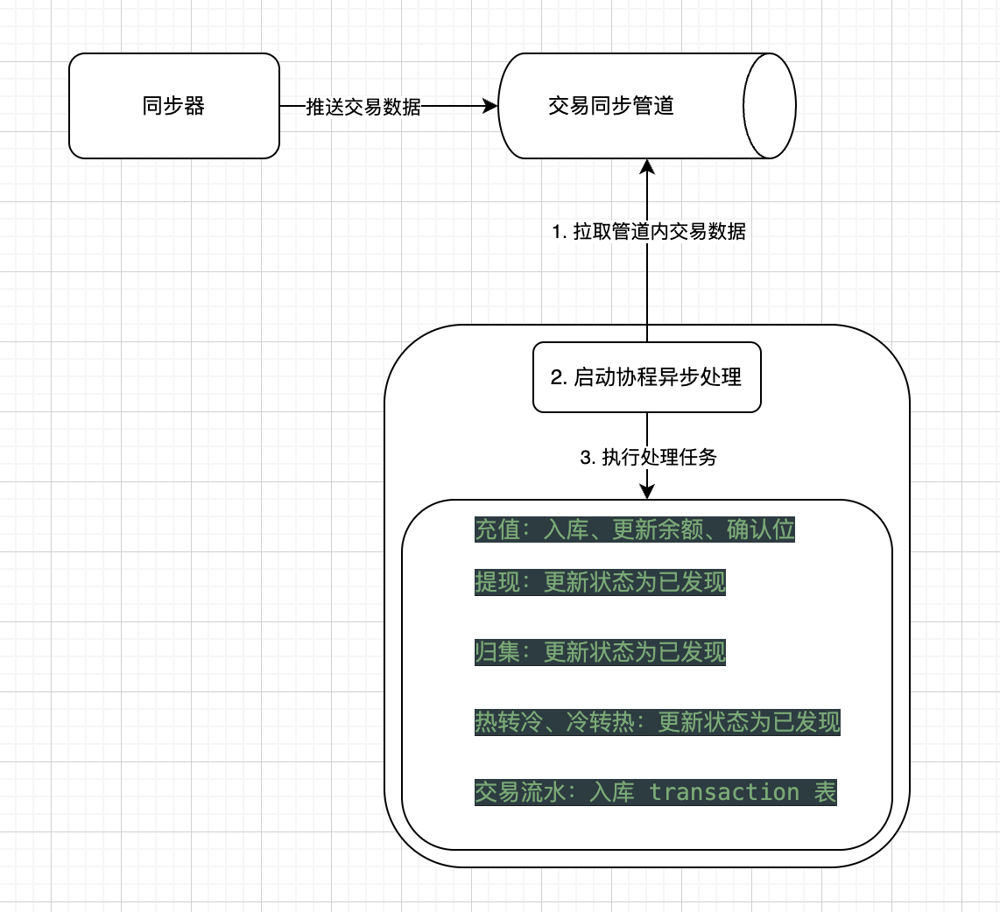

## 1. 项目搭建
- 新建项目 `exchange-wallet-service`
- 目录如下：
```
├── cmd                 主程序入口、命令行程序框架
├── common              通用工具库
├── config              配置文件管理代码
├── database            数据库代码
├── flags               环境变量管理代码
├── migrations          数据库迁移
├── notifier            回调通知管理
├── protobuf            grpc 接口及生成代码
├── rpcclient           grpc 连接客户端
├── services            grpc 服务管理及接口实现
├── sh                  shell 命令
├── worker              核心工作代码（充值、提现、归集、热转冷）
├── exchange.go         主程序生命周期管理
├── Makefile  shell     命令管理
├── devops.md           开发步骤
├── go.mod              依赖管理
├── README.md         
  ```
## 2. 控制台应用整合
- `main.go`
```
func main() {
	log.SetDefault(log.NewLogger(log.NewTerminalHandlerWithLevel(os.Stdout, log.LevelInfo, true)))
	app := NewCli(GitCommit, GitData)
	ctx := opio.WithInterruptBlocker(context.Background())
	if err := app.RunContext(ctx, os.Args); err != nil {
		log.Error("Application failed")
		os.Exit(1)
	}
}
```
- `cli.go`
```
func NewCli(GitCommit string, GitData string) *cli.App {
	//flags := flags2.Flags
	return &cli.App{
		Version:              params.VersionWithCommit(GitCommit, GitData),
		Description:          "An exchange wallet scanner services with rpc and rest api server",
		EnableBashCompletion: true,
		Commands: []*cli.Command{
			{
				Name:        "version",
				Description: "Show project version",
				Action: func(ctx *cli.Context) error {
					cli.ShowVersion(ctx)
					return nil
				},
			},
		},
	}
}
```

## 3. 数据库设计、gorm 搭建
- `Business(businessId,notifyUrl...)`: 注册商户表
- `Blocks(hash,parentHash,number...)`: 区块信息表
- `ReorgBlocks(hash,parentHash,number)`: 回滚区块表（回滚时处理交易使用）
- `Address(address,addressType,publicKey...)`: 钱包地址表
- `Balance(address,tokenAddress,balance,lockBalance...)`: 地址余额表
- `Deposit(from,to,amount,confirms,blockHash...)`: 充值表
- `Withdraw(from,to,amount,blockHash...)`: 提现表
- `Internals(from,to,amount,blockHash...)`: 内部交易表（归集、热转冷、冷转热）
- `Transactions(from,to,amount,fee,hash...)`: 交易流水表
- `Token(tokenAddress,decimals,collectAmount...)`: token合约表

- 数据库迁移脚本：`migrations` 文件夹中 
- 执行数据库迁移：执行 `make` 编译程序，然后 `./exchange-wallet-service migrate`
- 实现每一个表对应结构体、新增表、增删改查接口
## 4. rpc 搭建
- 编写 `exchange-wallet.proto`文件，定义消息和接口
- `make protogo` 生成对应的 protobuf 代码
- 搭建对接 `chains-union-rpc` 的 `client`(需先把`chains-union-rpc` 的 `protobuf` 代码复制过来)
- 搭建 `services`，新建包含 `db、rpcclient`、的 `grpc`，对接进 `urfave/cli` 的程序里，启动 `grpc` 服务
- 编写捕获 `panic` 的拦截器，传入给 grpc 处理
- 此程序提供的接口写在 `handler.go`

## 5. rpc 接口实现
- **业务方注册**：
    1. 业务方携带自己的 `requestId` 进行注册，系统会根据 `requestId` 为其生成独立的 `address`、`balance`、`transactions`、`deposits`、`withdraw`、`internal`、`tokens` 表
    2. 注册成功后，其所有业务都需要携带 `requestId` 进行请求，数据独立在其自己的表中。
    ```
  	BusinessRegister(context.Context, *BusinessRegisterRequest) (*BusinessRegisterResponse, error)
   ```
- **批量导出地址**：
    1. 业务方通过 “`signature-machine`” 项目（项目方自己部署，自己掌控私钥和签名流程）批量生成公钥，将公钥传入此接口，批量获取地址。
    2. 此接口中，会根据用户方传入的地址类型，保存该地址信息到 `address_{requestId}` 表中,并初始化 `balances`
    ```
  	ExportAddressesByPublicKeys(context.Context, *ExportAddressesRequest) (*ExportAddressesResponse, error)
  ```
- **构建未签名交易**：
    1. 在此接口中，业务方传入关键参数：`from`、`to`、`amount`、`chainId` 等信息，调用该接口。该接口会调用 “`chains-union-rpc`” 项目去获取地址的 `nonce`、`gasFee` 等。
    2. 然后构建 `EIP-1159` 的交易，调用 “`chains-union-rpc`” 项目去构建交易，返回 `16` 进制的未签名交易 `messageHash`（`32` 字节）、将交易信息保存在表中。返回 `messageHash` 和请求的 `transactionId`
    ```
      BuildUnSignTransaction(context.Context, *UnSignTransactionRequest) (*UnSignTransactionResponse, error)
  ```
- **构建已签名交易**：
    1. 项目方持有上述的未签名交易的 `messageHash`，调用 “`signature-machine`” 使用该交易对应的 `from` 地址私钥进行对此 `messageHash` 签名，返回 `signature` （`65` 字节） 信息
    2. 项目方拿到 `signature`、`transactionId`。 由 `transactionId` 从表中查出这笔交易，然后重新构造出来相同交易。调用 “`chains-union-rpc`” 的构建已签名接口，使用 `signature` 和 原交易信息发起调用 `BuildSignedTransaction`接口。
    3. 在“`chains-union-rpc`”中，会将 `signature` 拆分出 `r、s、v` 值和原交易组合起来，格式化返回一个已签名的交易（`16` 进制，`base64` 编码）
    4. 在拿到这个已签名交易的 `16` 进制数据后，即可调用 “`chains-union-rpc`” 里面的 `sendTx` 接口，将这笔交易公布到 `rpc` 网络中即可
    ```
  	BuildSignedTransaction(context.Context, *SignedTransactionRequest) (*SignedTransactionResponse, error)
  ```
- **设置合约地址**：
     1. 传入 ERC20 合约地址，作为合约项目白名单，存 tokens_{requestId} 表, 后续接入代币处理用。
    ```
  	SetTokenAddress(context.Context, *SetTokenAddressRequest) (*SetTokenAddressResponse, error)
  ```

- **联调** `exchange-wallet-service`、`signature-machine`、 `chains-union-rpc` **三个项目**

交易流程图

  1. exchange-wallet-service 业务方注册
  
  
  

  2. signature-machine 批量公钥生成

  
  

  3. exchange-wallet-service 公钥转地址

  
  

  4. 转资金进这个地址

  

  5. exchange-wallet-service 构建未签名交易
  
  
  

  6. signature-machine 中签名操作
  
  
  

  7. exchange-wallet-service 构建已签名交易
  
  
  

  8. chains-union-rpc 发送出去交易
  
  
  

  9. holesky 区块浏览器中查看这笔交易
  
  

## 6. 扫链同步器搭建
流程图


  - `worker` 下，建立 `synchronizer.go` 文件
    核心数据结构为一个管道，用于存放每个项目方的需要处理的批量交易
```go
      核心管道，存放一批次的交易，map 中的 key 为业务方 id*/
      buinessChannels chan map[string]*BatchTransactions
```

  - 在 cli.go 中集成启动扫链同步的任务
```go
    {
        Name:        "work",
        Flags:       flags,
        Description: "Run rpc scanner wallet chain node",
        Action:      cliapp.LifecycleCmd(runAllWorker),
    },
```
  - 使用定时任务启动 扫链同步器
```go
    	/*定时任务*/
	syncer.worker = clock.NewLoopFn(clock.SystemClock, syncer.tick, func() error {
		log.Info("shutting down synchronizer produce...")
		close(syncer.businessChannels)
		return nil
	}, syncer.loopInterval)
```
  - 调用封装的方法，通过 chains-union-rpc 接口批量获取区块头，并且判断链上是否出现回滚情况。
    如果出现某个区块的 `parentHash` 不等于上一个区块的 `hash` 则认为出现链回滚（重组的情况），
    则同步器会空转，无法获取到新的一批区块，直到重组区块被处理完成。（通过 `lastTraversalBlockHeader` 来进行标记处理）
```go
  /*headers 只有一个数据的情况（边界情况）：
  元素的 parentHash != lastTraversedHeader 的 Hash
  则说明发生链重组-->触发 fallback*/
  if len(headers) == 1 && f.lastTraversedHeader != nil && headers[0].ParentHash != f.lastTraversedHeader.Hash {
      log.Warn("lastTraversedHeader and header zero: parentHash and hash", "parentHash", headers[0].ParentHash, "Hash", f.lastTraversedHeader.Hash)
      return nil, blockHeader, true, ErrBlockFallBack
  }
  /*如果发现第 i 个 header 与 i-1 个不连续（parentHash 不匹配），
  也说明链断开或被重组。*/
  if len(headers) > 1 && headers[i-1].Hash != headers[i].ParentHash {
      log.Warn("headers[i-1] nad headers[i] parentHash and hash", "parentHash", headers[i].ParentHash, "Hash", headers[i-1].Hash)
      return nil, blockHeader, true, ErrBlockFallBack
		}
```
  - 区块头批量扫描完成后，即可进入交易解析的过程。
    1. 循环遍历区块头列表，每个区块获取这个区块内的交易
    2. 按照项目方匹配这个区块内的交易，匹配规则如下：
    ```go
    /*
      * 充值：from 地址为外部地址，to 地址为用户地址
      * 提现：from 地址为热钱包地址，to 地址为外部地址
      * 归集：from 地址为用户地址，to 地址为热钱包地址（默认热钱包地址为归集地址）
      * 热转冷：from 地址为热钱包地址，to 地址为冷钱包地址
      * 冷转热：from 地址为冷钱包地址，to 地址为热钱包地址
	    */
      ```
    3. 标记完交易后，所有项目方的筛选后的交易都放到一个核心的交易管道中，供后续的充值、提现、归集、热转冷、冷转热任务所使用。
    ```go
        /*核心管道，存放一批次的交易，map 中的 key 为业务方 id*/
        businessChannels chan map[string]*BatchTransactions
    ```
    4. 交易推送完后，还需要对所解析的区块进行存库，存储到 `blocks` 表中。然后清理上一批次的交易 `headers` 列表，使同步器能够进行下一次同步区块。
    ```go
        /*处理这一批次区块*/
        err := syncer.processBatch(syncer.headers)
        /*成功则清空 headers，进入到下一轮*/
        if err == nil {
            syncer.headers = nil
        }
    ```
### 扫块测试
- 启动扫链同步器服务


## 7. 交易发现器、充值业务实现
流程图



充值业务泳道图


  在之前的开发步骤中，我们实现了交易的同步器，负责将区块链上的区块扫描下来，并解析交易筛选出
  与我们交易所内所有项目方有关的地址，放到一个同步管道中。（属于生产者的角色）
  在这步的开发中，我们将实现一个消费者角色，也就是交易的发现器。
  在这个发现器中，我们将实现充值、提现、归集、转冷、转热交易的链上发现处理，
  并且完成充值确认位的处理，交易流水的入库处理。
  
  1. 协程异步启动交易发现器
  ```go
	/*协程异步处理任务*/
	f.tasks.Go(func() error {
		log.Info("handle deposit task start")
		for batch := range f.BaseSynchronizer.businessChannels {
			log.Info("deposit business channel", "batch length", len(batch))
			log.Error("=================", "batch length", len(batch))

			/* 实现所有交易处理*/
			if err := f.handleBatch(batch); err != nil {
				log.Info("failed to handle batch, stopping L2 Synchronizer:", "err", err)
				return fmt.Errorf("failed to handle batch, stopping L2 Synchronizer: %w", err)
			}
		}
		return nil
	})
  ```
  2. 消费 businessChannel 中的交易
    businessChannel 中一个map存放的是所有项目方的这批次的交易列表。将其按项目方取出来，
    然后分别对每一笔交易进行入库处理，需要处理的任务如下：

  ```go
    /*
    处理所有推送过来交易（一批次，所有有关项目方的都在这个 map 中）
    充值：库中原来没有，入库、更新余额。库中的充值更新确认位
    提现：库中原来有记录（项目方提交的），更新状态为已发现
    归集：库中原来有记录（项目方提交的），更新状态为已发现
    热转冷、冷转热：库中原来有记录（项目方提交的），更新状态为已发现
    交易流水：入库 transaction 表
    */
   ```

### 交易发现器测试
1. 启动之前余额


2. 转入资金


3. 运行 ./exchange-wallet-service work


4. 启动之后余额（等待确认位之后（10 个块））


## 8. 提现业务实现

## 9. 归集业务实现

## 10. 热转冷、冷转热业务实现

## 11. 回滚业务实现

## 12. 通知业务实现

