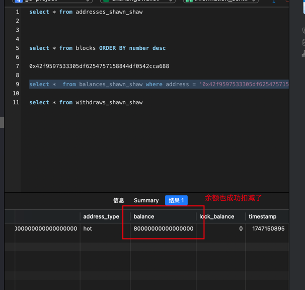
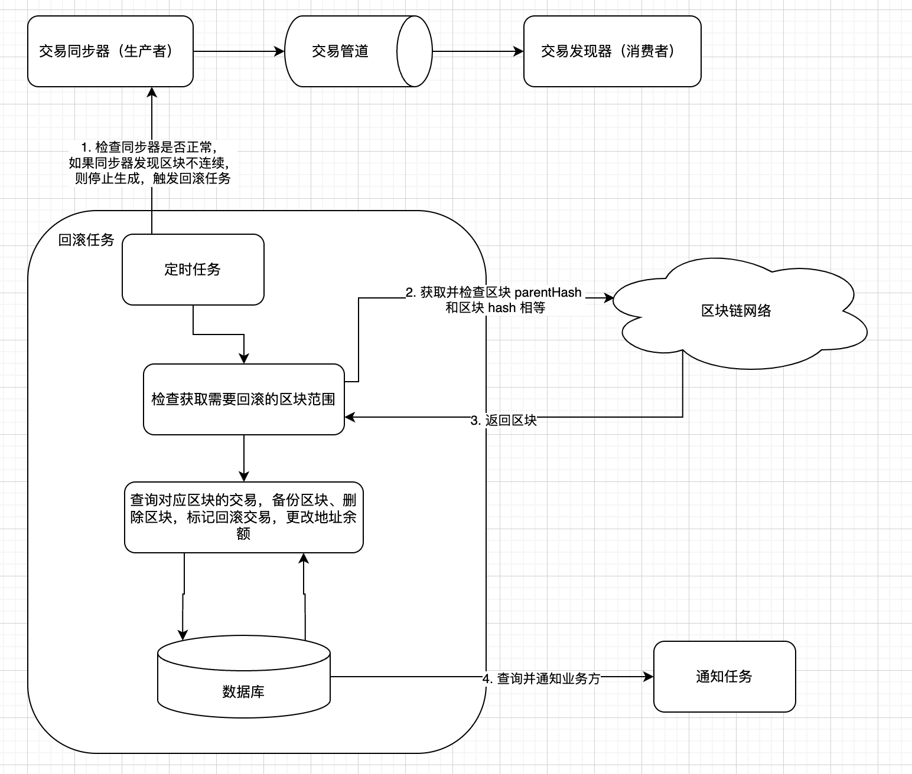
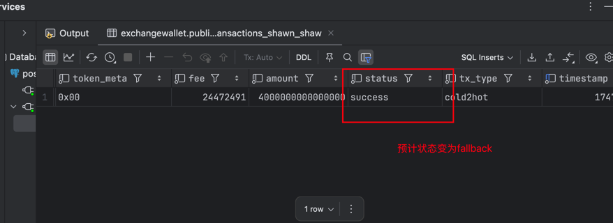
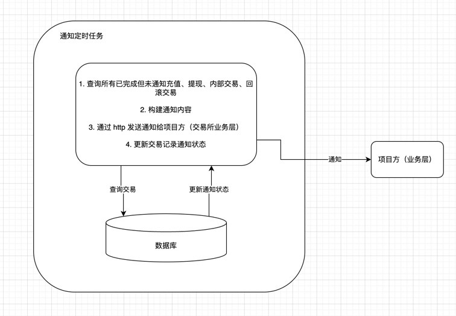
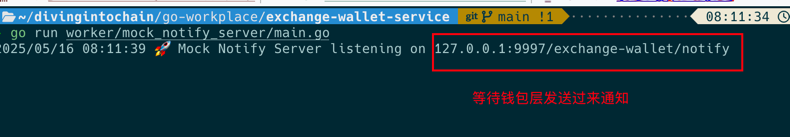

## 1. 项目搭建
- 新建项目 `exchange-wallet-service`
- 目录如下：
```
├── cmd                 主程序入口、命令行程序框架
├── common              通用工具库
├── config              配置文件管理代码
├── database            数据库代码
├── flags               环境变量管理代码
├── migrations          数据库迁移
├── notifier            回调通知管理
├── protobuf            grpc 接口及生成代码
├── rpcclient           grpc 连接客户端
├── services            grpc 服务管理及接口实现
├── sh                  shell 命令
├── worker              核心工作代码（充值、提现、归集、热转冷）
├── exchange.go         主程序生命周期管理
├── Makefile  shell     命令管理
├── devops.md           开发步骤
├── go.mod              依赖管理
├── README.md         
  ```
## 2. 控制台应用整合
- `main.go`
```
func main() {
	log.SetDefault(log.NewLogger(log.NewTerminalHandlerWithLevel(os.Stdout, log.LevelInfo, true)))
	app := NewCli(GitCommit, GitData)
	ctx := opio.WithInterruptBlocker(context.Background())
	if err := app.RunContext(ctx, os.Args); err != nil {
		log.Error("Application failed")
		os.Exit(1)
	}
}
```
- `cli.go`
```
func NewCli(GitCommit string, GitData string) *cli.App {
	//flags := flags2.Flags
	return &cli.App{
		Version:              params.VersionWithCommit(GitCommit, GitData),
		Description:          "An exchange wallet scanner services with rpc and rest api server",
		EnableBashCompletion: true,
		Commands: []*cli.Command{
			{
				Name:        "version",
				Description: "Show project version",
				Action: func(ctx *cli.Context) error {
					cli.ShowVersion(ctx)
					return nil
				},
			},
		},
	}
}
```

## 3. 数据库设计、gorm 搭建
- `Business(businessId,notifyUrl...)`: 注册商户表
- `Blocks(hash,parentHash,number...)`: 区块信息表
- `ReorgBlocks(hash,parentHash,number)`: 回滚区块表（回滚时处理交易使用）
- `Address(address,addressType,publicKey...)`: 钱包地址表
- `Balance(address,tokenAddress,balance,lockBalance...)`: 地址余额表
- `Deposit(from,to,amount,confirms,blockHash...)`: 充值表
- `Withdraw(from,to,amount,blockHash...)`: 提现表
- `Internals(from,to,amount,blockHash...)`: 内部交易表（归集、热转冷、冷转热）
- `Transactions(from,to,amount,fee,hash...)`: 交易流水表
- `Token(tokenAddress,decimals,collectAmount...)`: token合约表

- 数据库迁移脚本：`migrations` 文件夹中 
- 执行数据库迁移：执行 `make` 编译程序，然后 `./exchange-wallet-service migrate`
- 实现每一个表对应结构体、新增表、增删改查接口
## 4. rpc 搭建
- 编写 `exchange-wallet.proto`文件，定义消息和接口
- `make protogo` 生成对应的 protobuf 代码
- 搭建对接 `chains-union-rpc` 的 `client`(需先把`chains-union-rpc` 的 `protobuf` 代码复制过来)
- 搭建 `services`，新建包含 `db、rpcclient`、的 `grpc`，对接进 `urfave/cli` 的程序里，启动 `grpc` 服务
- 编写捕获 `panic` 的拦截器，传入给 grpc 处理
- 此程序提供的接口写在 `handler.go`

## 5. rpc 接口实现
- **业务方注册**：
    1. 业务方携带自己的 `requestId` 进行注册，系统会根据 `requestId` 为其生成独立的 `address`、`balance`、`transactions`、`deposits`、`withdraw`、`internal`、`tokens` 表
    2. 注册成功后，其所有业务都需要携带 `requestId` 进行请求，数据独立在其自己的表中。
    ```
  	BusinessRegister(context.Context, *BusinessRegisterRequest) (*BusinessRegisterResponse, error)
   ```
- **批量导出地址**：
    1. 业务方通过 “`signature-machine`” 项目（项目方自己部署，自己掌控私钥和签名流程）批量生成公钥，将公钥传入此接口，批量获取地址。
    2. 此接口中，会根据用户方传入的地址类型，保存该地址信息到 `address_{requestId}` 表中,并初始化 `balances`
    ```
  	ExportAddressesByPublicKeys(context.Context, *ExportAddressesRequest) (*ExportAddressesResponse, error)
  ```
- **构建未签名交易**：
    1. 在此接口中，业务方传入关键参数：`from`、`to`、`amount`、`chainId` 等信息，调用该接口。该接口会调用 “`chains-union-rpc`” 项目去获取地址的 `nonce`、`gasFee` 等。
    2. 然后构建 `EIP-1159` 的交易，调用 “`chains-union-rpc`” 项目去构建交易，返回 `16` 进制的未签名交易 `messageHash`（`32` 字节）、将交易信息保存在表中。返回 `messageHash` 和请求的 `transactionId`
    ```
      BuildUnSignTransaction(context.Context, *UnSignTransactionRequest) (*UnSignTransactionResponse, error)
  ```
- **构建已签名交易**：
    1. 项目方持有上述的未签名交易的 `messageHash`，调用 “`signature-machine`” 使用该交易对应的 `from` 地址私钥进行对此 `messageHash` 签名，返回 `signature` （`65` 字节） 信息
    2. 项目方拿到 `signature`、`transactionId`。 由 `transactionId` 从表中查出这笔交易，然后重新构造出来相同交易。调用 “`chains-union-rpc`” 的构建已签名接口，使用 `signature` 和 原交易信息发起调用 `BuildSignedTransaction`接口。
    3. 在“`chains-union-rpc`”中，会将 `signature` 拆分出 `r、s、v` 值和原交易组合起来，格式化返回一个已签名的交易（`16` 进制，`base64` 编码）
    4. 在拿到这个已签名交易的 `16` 进制数据后，即可调用 “`chains-union-rpc`” 里面的 `sendTx` 接口，将这笔交易公布到 `rpc` 网络中即可
    ```
  	BuildSignedTransaction(context.Context, *SignedTransactionRequest) (*SignedTransactionResponse, error)
  ```
- **设置合约地址**：
     1. 传入 ERC20 合约地址，作为合约项目白名单，存 tokens_{requestId} 表, 后续接入代币处理用。
    ```
  	SetTokenAddress(context.Context, *SetTokenAddressRequest) (*SetTokenAddressResponse, error)
  ```

- **联调** `exchange-wallet-service`、`signature-machine`、 `chains-union-rpc` **三个项目**

交易流程图

  1. exchange-wallet-service 业务方注册
  
  
  

  2. signature-machine 批量公钥生成

  
  

  3. exchange-wallet-service 公钥转地址

  
  

  4. 转资金进这个地址

  

  5. exchange-wallet-service 构建未签名交易
  
  
  

  6. signature-machine 中签名操作
  
  
  

  7. exchange-wallet-service 构建已签名交易
  
  
  

  8. chains-union-rpc 发送出去交易
  
  
  

  9. holesky 区块浏览器中查看这笔交易
  
  

## 6. 扫链同步器搭建
流程图


  - `worker` 下，建立 `synchronizer.go` 文件
    核心数据结构为一个管道，用于存放每个项目方的需要处理的批量交易
```go
      核心管道，存放一批次的交易，map 中的 key 为业务方 id*/
      buinessChannels chan map[string]*BatchTransactions
```

  - 在 cli.go 中集成启动扫链同步的任务
```go
    {
        Name:        "work",
        Flags:       flags,
        Description: "Run rpc scanner wallet chain node",
        Action:      cliapp.LifecycleCmd(runAllWorker),
    },
```
  - 使用定时任务启动 扫链同步器
```go
    	/*定时任务*/
	syncer.worker = clock.NewLoopFn(clock.SystemClock, syncer.tick, func() error {
		log.Info("shutting down synchronizer produce...")
		close(syncer.businessChannels)
		return nil
	}, syncer.loopInterval)
```
  - 调用封装的方法，通过 chains-union-rpc 接口批量获取区块头，并且判断链上是否出现回滚情况。
    如果出现某个区块的 `parentHash` 不等于上一个区块的 `hash` 则认为出现链回滚（重组的情况），
    则同步器会空转，无法获取到新的一批区块，直到重组区块被处理完成。（通过 `lastTraversalBlockHeader` 来进行标记处理）
```go
  /*headers 只有一个数据的情况（边界情况）：
  元素的 parentHash != lastTraversedHeader 的 Hash
  则说明发生链重组-->触发 fallback*/
  if len(headers) == 1 && f.lastTraversedHeader != nil && headers[0].ParentHash != f.lastTraversedHeader.Hash {
      log.Warn("lastTraversedHeader and header zero: parentHash and hash", "parentHash", headers[0].ParentHash, "Hash", f.lastTraversedHeader.Hash)
      return nil, blockHeader, true, ErrBlockFallBack
  }
  /*如果发现第 i 个 header 与 i-1 个不连续（parentHash 不匹配），
  也说明链断开或被重组。*/
  if len(headers) > 1 && headers[i-1].Hash != headers[i].ParentHash {
      log.Warn("headers[i-1] nad headers[i] parentHash and hash", "parentHash", headers[i].ParentHash, "Hash", headers[i-1].Hash)
      return nil, blockHeader, true, ErrBlockFallBack
		}
```
  - 区块头批量扫描完成后，即可进入交易解析的过程。
    1. 循环遍历区块头列表，每个区块获取这个区块内的交易
    2. 按照项目方匹配这个区块内的交易，匹配规则如下：
    ```go
    /*
      * 充值：from 地址为外部地址，to 地址为用户地址
      * 提现：from 地址为热钱包地址，to 地址为外部地址
      * 归集：from 地址为用户地址，to 地址为热钱包地址（默认热钱包地址为归集地址）
      * 热转冷：from 地址为热钱包地址，to 地址为冷钱包地址
      * 冷转热：from 地址为冷钱包地址，to 地址为热钱包地址
	    */
      ```
    3. 标记完交易后，所有项目方的筛选后的交易都放到一个核心的交易管道中，供后续的充值、提现、归集、热转冷、冷转热任务所使用。
    ```go
        /*核心管道，存放一批次的交易，map 中的 key 为业务方 id*/
        businessChannels chan map[string]*BatchTransactions
    ```
    4. 交易推送完后，还需要对所解析的区块进行存库，存储到 `blocks` 表中。然后清理上一批次的交易 `headers` 列表，使同步器能够进行下一次同步区块。
    ```go
        /*处理这一批次区块*/
        err := syncer.processBatch(syncer.headers)
        /*成功则清空 headers，进入到下一轮*/
        if err == nil {
            syncer.headers = nil
        }
    ```
### 扫块测试
- 启动扫链同步器服务


## 7. 交易发现器、充值业务实现
流程图


充值业务泳道图


  在之前的开发步骤中，我们实现了交易的同步器，负责将区块链上的区块扫描下来，并解析交易筛选出
  与我们交易所内所有项目方有关的地址，放到一个同步管道中。（属于生产者的角色）
  在这步的开发中，我们将实现一个消费者角色，也就是交易的发现器。
  在这个发现器中，我们将实现充值、提现、归集、转冷、转热交易的链上发现处理，
  并且完成充值确认位的处理，交易流水的入库处理。
  
  1. 协程异步启动交易发现器
  ```go
	/*协程异步处理任务*/
	f.tasks.Go(func() error {
		log.Info("handle deposit task start")
		for batch := range f.BaseSynchronizer.businessChannels {
			log.Info("deposit business channel", "batch length", len(batch))

			/* 实现所有交易处理*/
			if err := f.handleBatch(batch); err != nil {
				log.Info("failed to handle batch, stopping L2 Synchronizer:", "err", err)
				return fmt.Errorf("failed to handle batch, stopping L2 Synchronizer: %w", err)
			}
		}
		return nil
	})
  ```
  2. 消费 businessChannel 中的交易
    businessChannel 中一个map存放的是所有项目方的这批次的交易列表。将其按项目方取出来，
    然后分别对每一笔交易进行入库处理，需要处理的任务如下：

  ```go
    /*
    处理所有推送过来交易（一批次，所有有关项目方的都在这个 map 中）
    充值：库中原来没有，入库、更新余额。库中的充值更新确认位
    提现：库中原来有记录（项目方提交的），更新状态为已发现
    归集：库中原来有记录（项目方提交的），更新状态为已发现
    热转冷、冷转热：库中原来有记录（项目方提交的），更新状态为已发现
    交易流水：入库 transaction 表
    */
   ```

### 交易发现器测试
1. 启动之前余额


2. 转入资金


3. 运行 ./exchange-wallet-service work


4. 启动之后余额（等待确认位之后（10 个块））


## 8. 提现业务实现
在提现任务中，我们需要做的事情比较简单（因为在发现器中，我们已经将提现的发现流程处理了）
提现的任务主要分两步：
1. 发送提现交易
   1. 首先，我们需要使用热钱包地址构建一笔提现交易，form 地址为热钱包地址，to 地址为外部地址。调用之前 RPC 服务写好的构建未签名交易、签名机签名、构造已签名交易（前面的步骤已实现）
   2. 因为在构完已签名交易之后，我们会把这笔已签名交易存储到提现表中，其中包含已签名交易的完整的交易内容。所以，在这一步中，我们只需要使用协程启动一个定时任务，在定时任务中，
       将这笔交易从数据库中查询出来，然后调用接口发送到区块链网络，同时更新余额表和提现表即可。
    ```
   /*启动定时任务发送提现记录*/
    func (w *Withdraw) Start() error {
    log.Info("starting withdraw....")
    w.tasks.Go(func() error {
    for {
    select {
    case <-w.ticker.C:
    /*定时发送提现交易*/
    businessList, err := w.db.Business.QueryBusinessList()
    if err != nil {
    log.Error("failed to query business list", "err", err)
    continue
    }
    for _, business := range businessList {
    /*每个项目方处理已签名但未发出的交易*/
    unSendTransactionList, err := w.db.Withdraws.UnSendWithdrawsList(business.BusinessUid)
    if err != nil {
    log.Error("failed to unsend transaction", "err", err)
    continue
    }
    if unSendTransactionList == nil || len(unSendTransactionList) == 0 {
    log.Error("no withdraw transaction found", "businessId", business.BusinessUid)
    continue
    }
    
                        var balanceList []*database.Balances
    
                        for _, unSendTransaction := range unSendTransactionList {
                            /*每一笔提现交易发出去*/
                            txHash, err := w.rpcClient.SendTx(unSendTransaction.TxSignHex)
                            if err != nil {
                                log.Error("failed to send transaction", "err", err)
                                continue
                            } else {
                                /*成功更新余额*/
                                balanceItem := &database.Balances{
                                    TokenAddress: unSendTransaction.TokenAddress,
                                    Address:      unSendTransaction.FromAddress,
                                    /*发出提现，balance-，lockBalance+，*/
                                    LockBalance: unSendTransaction.Amount,
                                }
                                balanceList = append(balanceList, balanceItem)
                                unSendTransaction.TxHash = common.HexToHash(txHash)
                                /*已广播，未确认*/
                                unSendTransaction.Status = constant.TxStatusBroadcasted
                            }
                        }
    
                        retryStrategy := &retry.ExponentialStrategy{Min: 1000, Max: 20_000, MaxJitter: 250}
                        /*数据库重试*/
                        if _, err := retry.Do[interface{}](w.resourceCtx, 10, retryStrategy, func() (interface{}, error) {
                            /*事务*/
                            if err := w.db.Gorm.Transaction(func(tx *gorm.DB) error {
                                /*更新余额表*/
                                if len(balanceList) > 0 {
                                    log.Info("update withdraw balance transaction", "totalTx", len(balanceList))
                                    if err := w.db.Balances.UpdateBalanceListByTwoAddress(business.BusinessUid, balanceList); err != nil {
                                        log.Error("failed to update withdraw balance transaction", "err", err)
                                        return err
                                    }
                                }
    
                                /*更新提现表*/
                                if len(unSendTransactionList) > 0 {
                                    err = w.db.Withdraws.UpdateWithdrawListById(business.BusinessUid, unSendTransactionList)
                                    if err != nil {
                                        log.Error("update withdraw status fail", "err", err)
                                        return err
                                    }
                                }
                                return nil
                            }); err != nil {
                                return err, nil
                            }
                            return nil, nil
                        }); err != nil {
                            return err
                        }
                    }
                case <-w.resourceCtx.Done():
                    /*提现任务终止*/
                    log.Info("stopping withdraw in worker")
                    return nil
                }
            }
        })
        return nil
    }
    ```
2. 同步、发现提现交易（这一步已经在交易发现器中处理完毕，此处无需处理）

### 提现测试

1. 签名机生成秘钥对
   生成一个热钱包地址去使用


2. 注册进钱包业务
   将这个热钱包地址注册进交易所业务层中


3. 转钱给热钱包地址
   先给这个热钱包地址一点资金，作为提现所用


4. 手动修改数据库余额（模拟归集后热钱包有钱）
   因为不是在交易所钱包业务中归集的，所以需要手动改一下库用于测试

   

5. 构建一笔未签名交易
   调用交易所钱包业务的构建未签名交易接口

   

   

6. 签名这笔交易
   将未签名交易的 messageHash 交给签名机离线签名

   

7. 检查余额、提现记录
   先检查下交易还未发送之前的热钱包余额和提现记录情况，方便后续发出交易后对比

   
    （此处图片有笔误，应该是 0.1 ETH）

   

8. 构建已签名交易，等待发起
   调用钱包层已经签名交易的接口，钱包层收到后，定时任务会发现这笔交易已签名，调用发送交易发送到区块链
   网络上（交易状态为已广播）然后交易同步器、发现器发现这笔提现交易后，即修改交易状态为（完成）

   

9. 等待交易发出、扫块发现
   检查数据库中提现记录，发现提现交易已完成。再检查余额记录，发现 0.02 ETH 已被成功扣除。

   

   


## 9. 归集、热转冷、冷转热业务实现

归集业务、热转冷业务、冷转热业务在我们交易所中，可以将其归为一大类。因为这类的交易，
只需要交易所掌控的地址之间进行交互集合，无须与外部地址进行交易（充值、提现需要和外部地址进行交互）
所以，我们称这类业务为 Internal 内部交易。
下面是这三种交易的区别：

归集：from 地址为用户地址，to 地址为热钱包地址（归集地址）

热转冷： from 地址为热钱包地址，to 地址为冷钱包地址

冷转热：from 地址为冷钱包地址，to 地址为热钱包地址


### 交易所内归集交易的步骤


在交易所内，为了保证资金的安全，降低资金被盗的风险（热钱包地址安全级别更高），以及降低对账、提现等业务的难度。
通常来讲，会做一个资金的归集过程，也就是说：交易所会采取一系列的策略去将大量的用户地址的资金归集到一个归集地址上面去。
一般来说，归集的触发会有一个 “用户最小充值资金” 的概念，如果说用户充值金额很小， 
交易所有可能考虑到手续费的磨损、归集频繁程度，可能不会对小额充值进行归集。

归集业务有几种实现方式：

1. 批量归集
对于某些链，原生支持批量归集的操作。例如 UTXO 模型的链（如比特币），支持多个 UTXO 的输入，单个归集地址的输出。
这样就能原生实现链上的批量归集业务了。

2. 单笔归集
但是对于某些链，比如说非合约地址作为用户地址的以太坊，并不是原生支持批量转账的（Pectra 升级之前，升级之后可以批量转账），
在这种情况下，交易所对这种链的归集只能对进行每个用户地址进行单笔交易的归集。


- 提问：归集业务中，如果某个用户地址没有主币，那手续费谁来付？
一般来说，有两种情况：

    1. 一种情况是这个链具有原生支持 gas 代付的能力（例如 solana），那么，这个手续费只需要交易所在进行归集操作时，指定一个代付账号地址即可。
    
    2. 另一种情况是这个链不原生支持 gas 代付的能力（例如 Pectra 升级之前的以太坊），那么，
       这个手续费必须先由交易所的某个地址下发到需要归集的用户地址再进行归集的操作。

- 提问：某些链不需要归集，是怎么实现的？

某些链，可以在交易的时候携带 Tag（memo），这样的链无需进行归集的操作。因为：

1. 用户充值时候，将交易所的用户 id 填写到这个 Tag（memo）字段中。

2. 充值的资金直接打到交易所的热钱包地址中，无需给用户分配用户地址。

3. 交易所扫链发现这笔交易，将充值的资金分配给这个交易所的用户 id 即可。

### 内部交易的整体流程图


详细解释见下面交易所交易的实现

### 内部交易的实现
内部交易的实现实际上和我们的提现业务非常类似，都是由项目方发起，
且都是需要启动定时任务去扫描数据库中的已签名交易，发送到区块链网络中。
下面我来介绍下详细的步骤：

1. 项目方调用钱包业务层，生成未签名交易，获得 transactionId 和 32 字节的 messageHash

2. 项目方使用 messageHash 调用自己部署的签名机，签名这笔交易。

3. 项目方使用 transactionId 和 signature 去钱包层构建已签名交易。（钱包层会保存到数据库中）

4. 钱包层启动定时任务，扫描数据库中的内部交易（归集、转冷、转热），发送到区块链网络中，交易状态为已广播。

5. 钱包层的扫链同步器、交易发现器发现这笔内部交易，更新交易的状态为完成。

```go
/*
启动内部交易处理任务
处理归集、热转冷、冷转热
交易的发送到链上，更新库、余额
*/
func (in *Internal) Start() error {
	log.Info("starting internal worker.......")
	in.tasks.Go(func() error {
		for {
			select {
			case <-in.ticker.C:
				log.Info("starting internal worker...")
				businessList, err := in.db.Business.QueryBusinessList()
				if err != nil {
					log.Error("failed to query business list", "err", err)
					continue
				}
				for _, business := range businessList {
					/*分项目方处理*/
					unSendTransactionList, err := in.db.Internals.UnSendInternalsList(business.BusinessUid)
					if err != nil {
						log.Error("failed to query unsend internals list", "err", err)
						continue
					}
					if unSendTransactionList == nil || len(unSendTransactionList) <= 0 {
						log.Error("failed to query unsend internals list", "err", err)
						continue
					}

					var balanceList []*database.Balances

					for _, unSendTransaction := range unSendTransactionList {
						/*分单笔交易发送*/
						txHash, err := in.rpcClient.SendTx(unSendTransaction.TxSignHex)
						if err != nil {
							log.Error("failed to send internal transaction", "err", err)
							continue
						} else {
							/*发送成功, 处理from 地址余额*/
							balanceItem := &database.Balances{
								TokenAddress: unSendTransaction.TokenAddress,
								Address:      unSendTransaction.FromAddress,
								LockBalance:  unSendTransaction.Amount,
							}
							/*todo 缺少 to 地址的余额处理？*/

							balanceList = append(balanceList, balanceItem)

							unSendTransaction.TxHash = common.HexToHash(txHash)
							unSendTransaction.Status = constant.TxStatusBroadcasted
						}
					}
					retryStrategy := &retry.ExponentialStrategy{Min: 1000, Max: 20_000, MaxJitter: 250}
					if _, err := retry.Do[interface{}](in.resourceCtx, 10, retryStrategy, func() (interface{}, error) {
						if err := in.db.Gorm.Transaction(func(tx *gorm.DB) error {
							/*处理内部交易余额*/
							if len(balanceList) > 0 {
								log.Info("Update address balance", "totalTx", len(balanceList))
								if err := in.db.Balances.UpdateBalanceListByTwoAddress(business.BusinessUid, balanceList); err != nil {
									log.Error("Update address balance fail", "err", err)
									return err
								}

							}
							/*保存内部交易状态*/
							if len(unSendTransactionList) > 0 {
								err = in.db.Internals.UpdateInternalListById(business.BusinessUid, unSendTransactionList)
								if err != nil {
									log.Error("update internals status fail", "err", err)
									return err
								}
							}
							return nil
						}); err != nil {
							log.Error("unable to persist batch", "err", err)
							return nil, err
						}
						return nil, nil
					}); err != nil {
						return err
					}
				}

			case <-in.resourceCtx.Done():
				log.Info("worker is shutting down")
				return nil
			}
		}
	})
	return nil
}
```

### 归集测试

1. 构建未签名交易


2. 签名机签名


3. 构建已签名交易


4. 归集前余额


5. 启动同步器、发现器、内部交易定时任务后查看余额变化


### 热转冷测试
1. 交易构建和签名过程和之前的测试一样，这里省略...

2. 热转冷前的余额


3. 热转冷后的余额


### 冷转热测试
1. 交易构建和签名过程和之前的测试一样，这里省略...

2. 冷转热之前的余额


3. 冷转热之后的余额


## 11. 回滚业务实现

### 什么是回滚业务
在交易所钱包中，回滚是必须要考虑的一件事情。因为去中心化网络的不能由中心化节点控制。所以在多个矿工同时挖出新区块的时候，会形成临时分叉。
但是出现分叉又必然回归到主链中，因为无论怎么分叉，总会有一条链是最长的。区块链中，只会承认长的那条链，而短的那条链中的交易，会被抛弃或重组。

我们可以想象一下，如果我们钱包中不处理回滚业务。此时如果我们用户进行充值，我们钱包系统中，扫链发现了这笔交易，充值完成。但是，此时发生了链上的重组，
链上资金又回到了用户的地址，但是我们交易所又给他分配了相应的资金，这样则会造成我们交易所资金的亏损。

### 回滚分为两种类型：

- **长分叉回滚**：
这种情况指得是，当存在节点群进行网络操控，进行断网的情况下出块，并且出了相对较长的链。当这个节点群重新联网时，区块链网络会对比两条链的长度，
并选择较长的一条链作为主链，短的那条链则被抛弃，其中交易会被丢弃，资金没有实际转出去。

- **短分叉重组**：
短分叉重组的情况指得是，当我们区块链网络进行了短暂的分叉，通常只有一到两个块的分叉，很快又可以进行恢复。
此时，被抛弃的分叉中仍然有效的交易会被重组打包进新的区块中，交易并不一定会实际丢失。此时表现为：交易的 `id` 一致，但是其区块的 `hash` 仍然是不一致的。

无论是回滚还是重组，我们在宏观的层面上，都可以看做回滚进行处理就行了。
例如：

1. 我们有一笔充值 `100` 的交易，资金从外部地址转移到交易所用户地址中。

2. 交易所检测到了交易，用户地址余额记录增加 100。

3. 在没到确认位之前发生回滚，链上资金回到外部地址，用户地址余额记录减少 100。

4. 但如果是重组交易重新打包呢？其实流程仍然是一致的，回滚业务照常处理即可， 用户地址余额记录减少 100。

5. 因为是重组交易被重新打包了，那我们进行回滚业务完了后（出错的块会被删除），正常扫块，仍可以发现这笔充值交易，那么，用户的资金成功转出去了，
交易所的用户地址成功收到了这笔资金，用户地址又重新加上了 `100`，这样就相当于 `+100-100+100`。数据仍然是正确的。

**可能有细心的朋友关注到了，上面我提到了一个确认位的概念，那么，什么是确认位呢，在交易所中有什么作用呢？**
答：

确认位是交易所为了降低链回滚等不确定因素影响的一种安全机制，常用于充值交易中。

1. 用户充值 `100` ，交易所发现后交易后，记录上账，但不能进行提现。防止在短时间内链回滚造成资金的损失。

2. 假如我们设置了确认位为 `10` 个块后确认，那么在 `10` 个块内发生回滚，则交易所会回收用户在交易所的资金，保证交易所不出现亏损。

3. 假如在过了 `10` 个块后，链才发生回滚，那么交易所只能自认倒霉了，自己承担链回滚造成的损失（链上资金回到外部地址、交易所资金也分配给用户了）

### 回滚业务的流程
上面讲了这么多，但其实还都是些概念性的东西，没进入到交易所内回滚业务是怎么实现的。下面，我将以一张流程图，来给你分析明白，
交易所内的回滚流程是怎么进行处理的。



由上面图中可以看到，我们回滚任务仍然是一个定时任务。他主要的任务是监听我们生产者的状态。
1. 如果交易同步器（生产者）在扫描区块链，发现链上的区块和数据库中的区块 `hash` 不一致（`parentHash` 不等于上一个块的 `hash`）
则认为链上发生了回滚的情况。这时候，我们的同步器会无法正常生产数据，并标记为回滚状态。

2. 在回滚任务的这个定时任务中，如果发现了生产者是回滚状态，则其执行回滚任务。

3. 回滚任务首先要执行发现回滚块的任务，其操作流程是：以同步器标记的需要回滚的块往回找，回溯到其 parentHash 与前一个块 hash 相等位置。
此时，则获取到了需要回滚的块的范围（例如块 100 到块 90 需要被回滚）

4. 在获得了回滚范围之后，我们所需要处理的任务只剩下处理数据库了。我们只需要将数据块中的 90 - 100 这个回滚范围内的块备份一下，
放到一个回滚表中，然后把原表删除掉（等同步器去重新扫这范围内的块即可）。
然后我们还需要处理充值、提现、归集、热转冷、冷转热交易以及交易流水表、余额表的数据库状态即可。
对充值、提现、归集、热转冷、冷转热、流水表标记为“已回滚”的状态，处理余额表（逆向加减余额）

**讲到这里，有同学可能要问了**：**我们回滚不需要重新发起交易的吗，为什么只需要更新数据库即可？**

实际上，我们并不是不重新发起交易，而是把这个发起交易的权限给到了项目方（或者交易所钱包业务层），
我们只负责通知，然后让业务层去重新发起调用发起交易。（例如提现，我们通知他回滚了让他重新发起提现即可。我们不做偷偷发起交易这种事情。。。）

### 回滚业务的实现
说多了无益，下面我们直接来 show 代码：

```go

/*启动*/
func (fb *Fallback) Start() error {
	log.Info("start fallback.........")
	fb.tasks.Go(func() error {
		for {
			select {
			case <-fb.ticker.C:
				if fb.BaseSynchronizer.isFallback {
					log.Info("fallback task", "synchronizer fallback handle", fb.BaseSynchronizer.fallbackBlockHeader.Number)
					if err := fb.onFallback(fb.BaseSynchronizer.fallbackBlockHeader); err != nil {
						log.Error("failed to notify fallback", "err", err)
					}
					dbLatestBlockHeader, err := fb.database.Blocks.LatestBlocks()
					if err != nil {
						log.Error("query latest block fail", "err", err)
					}
					/*传入新的 dbLatestBlockHeader，重新启动扫块*/
					fb.BaseSynchronizer.blockBatch = rpcclient.NewBatchBlock(fb.rpcClient, dbLatestBlockHeader, big.NewInt(int64(fb.confirmations)))
					/*处理完回滚，取消回滚状态*/
					fb.BaseSynchronizer.isFallback = false
					fb.BaseSynchronizer.fallbackBlockHeader = nil
				}
			case <-fb.resourceCtx.Done():
				log.Info("stop fallback.........")
				return nil
			}
		}
	})
	return nil
}

/*回滚区块表、充值、提现、内部、流水、余额表处理*/
func (fb *Fallback) onFallback(fallbackBlockHeader *rpcclient.BlockHeader) error {
	reorgBlockHeaders, chainBlocks, entryBlockHeader, err := fb.findFallbackEntry(fallbackBlockHeader)
	if err != nil {
		log.Error("failed to find fallback entry", "err", err)
		return err
	}

	businessList, err := fb.database.Business.QueryBusinessList()
	if err != nil {
		log.Error("failed to query business list", "err", err)
		return err
	}

	var fallbackBalances []*database.TokenBalance
	for _, business := range businessList {
		log.Info("handle business", "businessUid", business.BusinessUid)
		/*范围内的交易记录*/
		transactionList, err := fb.database.Transactions.QueryFallBackTransactions(business.BusinessUid, entryBlockHeader.Number, fallbackBlockHeader.Number)
		if err != nil {
			log.Error("failed to query fallback transactions", "err", err)
			return err
		}
		for _, transaction := range transactionList {
			fallbackBalances = append(fallbackBalances, &database.TokenBalance{
				FromAddress:  transaction.FromAddress,
				ToAddress:    transaction.ToAddress,
				TokenAddress: transaction.TokenAddress,
				Balance:      transaction.Amount,
				TxType:       transaction.TxType,
			})
		}
	}

	retryStrategy := &retry.ExponentialStrategy{Min: 1000, Max: 20_000, MaxJitter: 250}
	if _, err := retry.Do[interface{}](fb.resourceCtx, 10, retryStrategy, func() (interface{}, error) {
		if err := fb.database.Transaction(func(tx *database.DB) error {
			if len(reorgBlockHeaders) > 0 {
				/*被回滚的区块备份*/
				if err := tx.ReorgBlocks.StoreReorgBlocks(reorgBlockHeaders); err != nil {
					log.Error("failed to store reorg blocks", "err", err)
					return err
				}
				log.Info("store reorg block success", "totalTx", len(reorgBlockHeaders))
			}

			if len(chainBlocks) > 0 {
				if err := tx.Blocks.DeleteBlocksByNumber(chainBlocks); err != nil {
					return err
				}
				log.Info("delete block success", "totalTx", len(chainBlocks))
			}
			/*存在回滚块，标记其中交易（根据交易通知业务层去让其做逆向交易）*/
			if fallbackBlockHeader.Number.Cmp(entryBlockHeader.Number) > 0 {
				for _, business := range businessList {
					/*充值回滚*/
					if err := tx.Deposits.HandleFallBackDeposits(business.BusinessUid, entryBlockHeader.Number, fallbackBlockHeader.Number); err != nil {
						log.Error("failed to handle fallback deposits", "err", err)
						return err
					}
					/*提现回滚*/
					if err := tx.Withdraws.HandleFallBackWithdraw(business.BusinessUid, entryBlockHeader.Number, fallbackBlockHeader.Number); err != nil {
						log.Error("failed to handle fallback withdraws", "err", err)
						return err
					}

					/*内部交易回滚*/
					if err := tx.Internals.HandleFallBackInternals(business.BusinessUid, entryBlockHeader.Number, fallbackBlockHeader.Number); err != nil {
						log.Error("failed to handle fallback internals", "err", err)
						return err
					}
					/*流水表回滚*/
					if err := tx.Transactions.HandleFallBackTransactions(business.BusinessUid, entryBlockHeader.Number, fallbackBlockHeader.Number); err != nil {
						log.Error("failed to handle fallback transactions", "err", err)
						return err
					}
					/*余额回滚*/
					if err := tx.Balances.UpdateFallBackBalance(business.BusinessUid, fallbackBalances); err != nil {
						log.Error("failed to update fallback balance", "err", err)
						return err
					}
				}
			}
			return nil
		}); err != nil {
			log.Error("unable to persist fallback batch", "err", err)
			return nil, err
		}
		return nil, nil
	}); err != nil {
		return err
	}

	return nil
}

/*找到回滚初始块并返回*/
func (fb *Fallback) findFallbackEntry(fallbackBlockHeader *rpcclient.BlockHeader) ([]database.ReorgBlocks, []database.Blocks, *rpcclient.BlockHeader, error) {
	var reorgBlockHeaders []database.ReorgBlocks
	var chainBlocks []database.Blocks

	lastBlockHeader := fallbackBlockHeader

	/*寻找到回滚的分叉点*/
	for {
		/*往回查找*/
		lastBlockNumber := new(big.Int).Sub(lastBlockHeader.Number, bigint.One)
		log.Info("start get block header info...", "last block number", lastBlockNumber)

		/*链上这个块*/
		chainBlockHeader, err := fb.rpcClient.GetBlockHeader(lastBlockNumber)
		if err != nil {
			log.Warn("failed to get block header info from chain", "err", err)
			return nil, nil, nil, fmt.Errorf("failed to get block header info from chain: %w", err)
		}
		/*数据库中*/
		dbBlockHeader, err := fb.database.Blocks.QueryBlocksByNumber(lastBlockNumber)
		if err != nil {
			log.Warn("failed to get block header info from database", "err", err)
			return nil, nil, nil, fmt.Errorf("failed to get block header info from database: %w", err)
		}
		log.Info("query blocks from database success", "last block number", lastBlockNumber)
		/*需要删除的*/
		chainBlocks = append(chainBlocks, database.Blocks{
			Hash:       dbBlockHeader.Hash,
			ParentHash: dbBlockHeader.ParentHash,
			Number:     dbBlockHeader.Number,
			Timestamp:  dbBlockHeader.Timestamp,
		})
		/*需要备份的*/
		reorgBlockHeaders = append(reorgBlockHeaders, database.ReorgBlocks{
			Hash:       dbBlockHeader.Hash,
			ParentHash: dbBlockHeader.ParentHash,
			Number:     dbBlockHeader.Number,
			Timestamp:  dbBlockHeader.Timestamp,
		})
		log.Info("lastBlockHeader chainBlockHeader", "lastBlockParentHash", lastBlockHeader.ParentHash, "lastBlockNumber", lastBlockHeader.Number, "chainBlockHash", chainBlockHeader.Hash, "chainBlockHeaderNumber", chainBlockHeader.Number)

		/*已找到分叉点，正常终止*/
		if lastBlockHeader.ParentHash == chainBlockHeader.Hash {
			lastBlockHeader = chainBlockHeader
			return reorgBlockHeaders, chainBlocks, chainBlockHeader, nil
		}
		/*往前移动*/
		lastBlockHeader = chainBlockHeader
	}
}
```

### 回滚测试
1. 修改数据库，模拟区块发生回滚，区块 hash 不正确


2. 在不连续的区块上，伪造一笔交易，测试回滚


2. 回滚之前的 transaction 流水表、balance 余额表




3. 回滚之后的 blocks 表、reorgBlocks表、流水表、余额表


## 12. 通知业务实现

## 通知业务是什么
通知业务指得是，交易所钱包将交易的状态变更情况通知上层调用者，告知他们某笔交易的状态如何。
在交易所的通知业务中，钱包的通知实现相对比较简单。因为我们所有的交易请求都是有项目方（或者交易所业务层）请求调用的，
为了保证我们整个交易所系统的安全性，所以我们钱包业务中，不会去主动构造交易。
所以说，我们在进行发起链上交易交互的时候，我们钱包业务中，所需要做的就是，
给上层调用者发送通知，告诉他们这笔交易的状态是怎样的，方便他们进行相关业务操作。
例如：

- 充值：1. 钱包发现这笔充值交易，通知业务交易已上账。 2. 钱包发现某笔交易过了确认位，通知业务某笔交易已成功。
- 回滚：1. 钱包发现某笔交易被回滚，通知业务交易已被回滚。

## 通知业务的流程图



交易所钱包系统中，我们的交易发现器会将交易从链上发现，并且变更交易的状态到数据库中。
1. 通过查询数据库获取需要发送通知但还未通知的交易。例如充值上账、充值确认、提现已广播、交易回滚等。
2. 构建相应的通知内容，通过项目方（业务层）配置的 http 接口进行发送出去
3. 如果发送成功，则变更交易的通知状态为已成功通知


## 通知业务的实现
来上代码：

```go

/*启动通知任务*/
func (nf *Notifier) Start() error {
	log.Info("start notifier worker...")
	nf.tasks.Go(func() error {
		for {
			select {
			case <-nf.ticker.C:
				var txn []Transaction
				/*每个项目方去查询相应业务表，发出通知*/
				for _, businessId := range nf.businessIds {
					log.Info("start notifier business", "business", businessId, "txn", txn)

					/*查出应通知的充值交易*/
					needNotifyDeposits, err := nf.db.Deposits.QueryNotifyDeposits(businessId)
					if err != nil {
						log.Error("Query notify deposits fail", "err", err)
					}
					/*查出应通知的提现*/
					needNotifyWithdraws, err := nf.db.Withdraws.QueryNotifyWithdraws(businessId)
					if err != nil {
						log.Error("Query notify withdraw fail", "err", err)
					}
					/*查出应通知的内部交易*/
					needNotifyInternals, err := nf.db.Internals.QueryNotifyInternal(businessId)
					if err != nil {
						log.Error("Query notify internal fail", "err", err)
					}

					/*构建通知请求体*/
					notifyRequest, err := nf.BuildNotifyTransaction(needNotifyDeposits, needNotifyWithdraws, needNotifyInternals)
					if err != nil {
						log.Error("Build notify transaction fail", "err", err)
					}
					if notifyRequest.Txn == nil || len(notifyRequest.Txn) == 0 {
						log.Warn("no notify transaction to notify, wait for notify")
						continue
					}

					/*发送通知*/
					notify, err := nf.notifier[businessId].BusinessNotify(notifyRequest)
					if err != nil {
						log.Error("notify business platform fail", "err", err)
					}
					log.Info("After notify", "business", businessId, "notifyStatus", notify, "deposits", needNotifyDeposits, "err", err)
					err = nf.AfterNotify(businessId, notify, needNotifyDeposits, needNotifyWithdraws, needNotifyInternals)
					if err != nil {
						log.Error("change notified status fail", "err", err)
					}

				}
			case <-nf.resourceCtx.Done():
				log.Info("notifier worker shutting down")
				return nil
			}
		}
	})
	return nil
}

/*通知之前：更新通知前状态*/
func (nf *Notifier) AfterNotify(businessId string, notifySuccess bool, deposits []*database.Deposits, withdraws []*database.Withdraws, internals []*database.Internals) error {
	if !notifySuccess {
		log.Warn("notify business platform fail", "business", businessId)
		return fmt.Errorf("notify business platform fail, businessId: %v", businessId)
	}
	depositsNotifyStatus := constant.TxStatusNotified
	withdrawNotifyStatus := constant.TxStatusNotified
	internalNotifyStatus := constant.TxStatusNotified

	// 过滤状态为 0 的交易
	var updateStutusDepositTxn []*database.Deposits
	for _, deposit := range deposits {
		if deposit.Status != constant.TxStatusCreateUnsigned {
			updateStutusDepositTxn = append(updateStutusDepositTxn, deposit)
		}
	}
	/*更新通知前状态（待通知）*/
	retryStrategy := &retry.ExponentialStrategy{Min: 1000, Max: 20_000, MaxJitter: 250}
	if _, err := retry.Do[interface{}](nf.resourceCtx, 10, retryStrategy, func() (interface{}, error) {
		if err := nf.db.Transaction(func(tx *database.DB) error {
			if len(deposits) > 0 {
				if err := tx.Deposits.UpdateDepositsStatusByTxHash(businessId, depositsNotifyStatus, updateStutusDepositTxn); err != nil {
					return err
				}
			}
			if len(withdraws) > 0 {
				if err := tx.Withdraws.UpdateWithdrawStatusByTxHash(businessId, withdrawNotifyStatus, withdraws); err != nil {
					return err
				}
			}

			if len(internals) > 0 {
				if err := tx.Internals.UpdateInternalStatusByTxHash(businessId, internalNotifyStatus, internals); err != nil {
					return err
				}
			}
			return nil
		}); err != nil {
			log.Error("unable to persist batch", "err", err)
			return nil, err
		}
		return nil, nil
	}); err != nil {
		return err
	}
	return nil
}
```

## 通知业务测试
1. 写个程序用于模拟项目方（钱包层）接收通知
```go
type NotifyRequest struct {
	Txn []httpclient.Transaction `json:"txn"`
}

func main() {
	http.HandleFunc("/exchange-wallet/notify", func(w http.ResponseWriter, r *http.Request) {
		log.Println("📩 Received a request")

		body, err := io.ReadAll(r.Body)
		if err != nil {
			http.Error(w, "failed to read body", http.StatusInternalServerError)
			return
		}
		defer r.Body.Close()

		var req NotifyRequest
		if err := json.Unmarshal(body, &req); err != nil {
			http.Error(w, "invalid JSON", http.StatusBadRequest)
			log.Println("❌ Invalid JSON:", err)
			return
		}

		// 打印格式化的 JSON
		fmt.Println("🧾 Parsed JSON request:")
		pretty, _ := json.MarshalIndent(req, "", "  ")
		fmt.Println(string(pretty))

		w.Header().Set("Content-Type", "application/json")
		w.Write([]byte(`{"success":true}`))
	})

	addr := "127.0.0.1:9997/exchange-wallet/notify"
	log.Println("🚀 Mock Notify Server listening on", addr)
	if err := http.ListenAndServe("127.0.0.1:9997", nil); err != nil {
		log.Fatal("❌ Server failed:", err)
	}
}

```
2. 启动这个模拟程序

3. 充值一笔试试，等待 10 个确认位


至此，钱包的所有业务解析完毕！！！
后续，钱包有一些 bug 以及优化什么的，等我慢慢 fix 吧 hhh
如果有愿意参加这个开源项目去参与贡献的，欢迎联系我（或者直接 github 上 issue 交流也可以的）