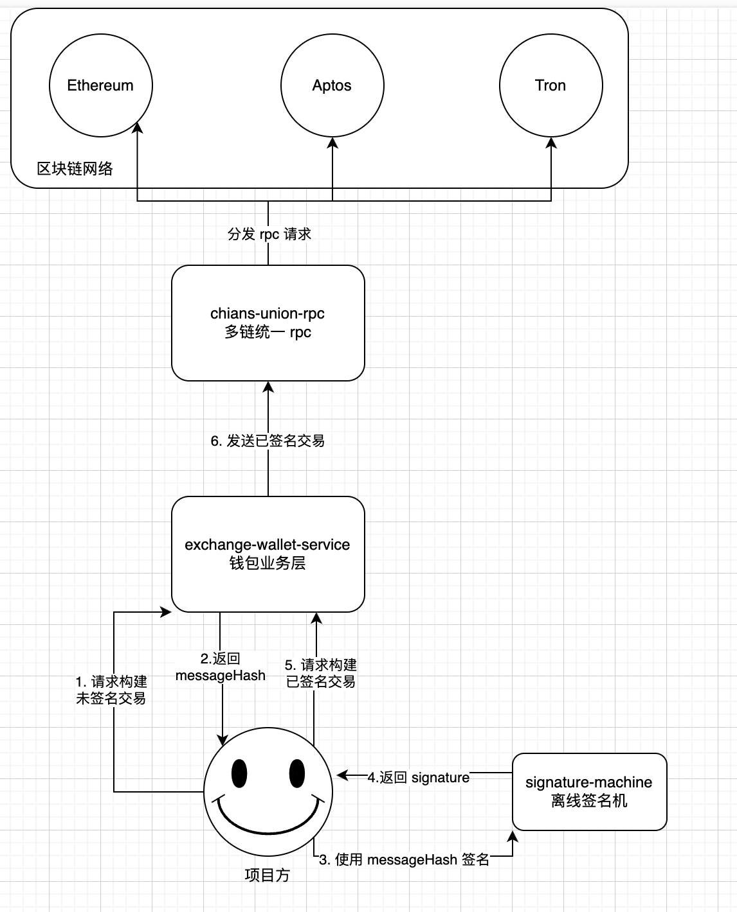

# exchange-wallet-service


[](https://goreportcard.com/report/github.com/Shawn-Shaw-x/exchange-wallet-service)

`exchange-wallet-service` 是一个基于 gRPC 和 PostgreSQL 构建的高性能钱包服务，支持交易所钱包 SaaS 化部署，为多项目方提供账户体系、链上交易扫描、充值提现管理、热冷钱包归集与划转等全功能解决方案。

PS: 本钱包项目基于交易所钱包业务抽象、简化而来。添加多租户支持，可提供项目方 Sass 化支持

## ✨ 功能特性

- **多项目方接入支持**：每个项目方独立账户体系，隔离资金与操作权限。
- **充值服务**：支持扫链识别入账交易，自动处理充值交易，项目方自控权限归集至热/冷钱包。
- **提现服务**：离线签名与审核流程支持，确保资产安全。
- **热转冷 & 冷转热**：支持按规则由项目方执行热钱包与冷钱包资产调配。
- **链上交易扫描**：高效同步链上交易数据，触发充值/通知等业务。
- **通知机制**：支持通过 Http、gRPC 等形式将充值、提现等事件推送给业务方。
- **SaaS 化部署**：支持以服务化方式快速部署，为多租户提供统一服务。

## 🧱 技术栈

| 技术 | 描述 |
|------|------|
| gRPC | 服务间通信协议，定义清晰的 protobuf 接口 |
| GORM | Go ORM 框架，简化数据库访问 |
| PostgreSQL | 持久化存储引擎 |
| Protobuf | 用于服务接口定义和数据结构描述 |
| Makefile | 标准化开发与部署流程 |
| Go Modules | 依赖管理与构建 |

## 📂 项目结构

```
├── cmd                 主程序入口、命令行程序框架
├── common              通用工具库
├── config              配置文件管理代码
├── database            数据库代码
├── flags               环境变量管理代码
├── migrations          数据库迁移
├── notifier            回调通知管理
├── protobuf            grpc 接口及生成代码
├── rpcclient           grpc 连接客户端
├── services            grpc 服务管理及接口实现
├── sh                  shell 命令
├── worker              核心工作代码（充值、提现、归集、热转冷）
├── exchange.go         主程序生命周期管理
├── Makefile  shell     命令管理
├── devops.md           开发步骤
├── go.mod              依赖管理
├── README.md   
```

## 🚀 快速启动

### 1. 克隆项目

```bash
git clone https://github.com/Shawn-Shaw-x/exchange-wallet-service.git
cd exchange-wallet-service
```

### 2. 启动数据库（PostgreSQL）

推荐使用 Docker：

```bash
docker-compose up -d
```
创建空数据库 `exchangewallet`, 配置好连接参数。

### 3. 加载环境变量
```bash
source .env
```

### 4. 编译并启动服务

```bash
make 
./exchange-wallet-service
```


### 5. 运行测试

```bash
make test
```

## 🛠️ 6. 常用 Make 命令

| 命令           | 描述             |
|--------------|----------------|
| `make `      | 构建服务二进制        |
| `make clean` | 清理应用           |
| `make test`  | 运行测试用例         |
| `make proto` | 编译 protobuf 代码 |
| `make lint`  | 代码格式化          |

## 🍌 项目架构图

### 整体架构图


### 一笔 withdraw 交易的流程图


### 扫链同步器（生产者）流程图


## 交易发现器（消费者）流程图


## 充值业务泳道图


## 👬🏻 Partners

- shawn_shaw: cola_ocean@foxmail.com
- 0xManta: manta_0x@icloud.com

## 📄 License

MIT © 2025 exchange-wallet-team
