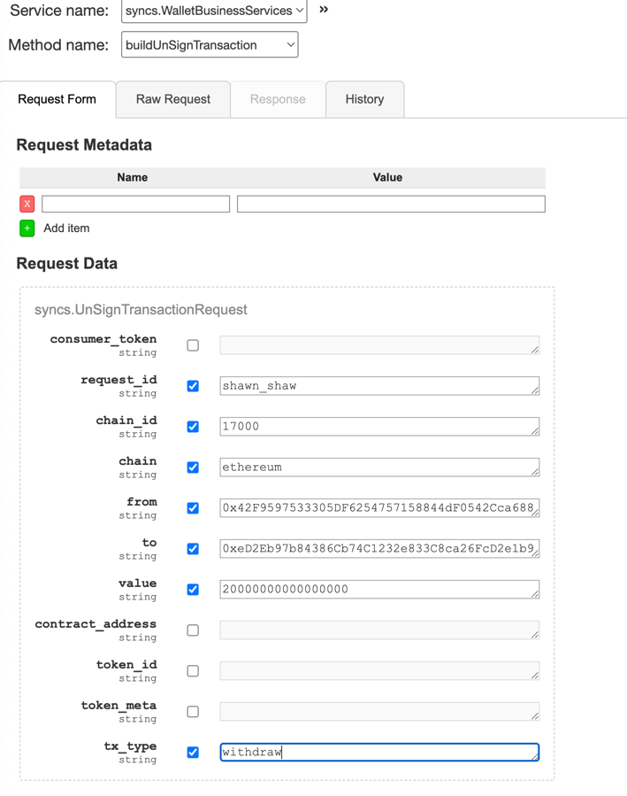
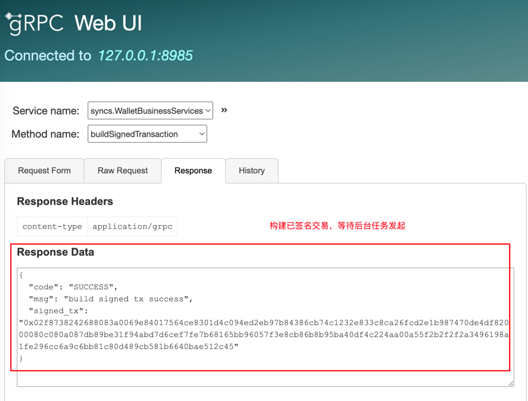
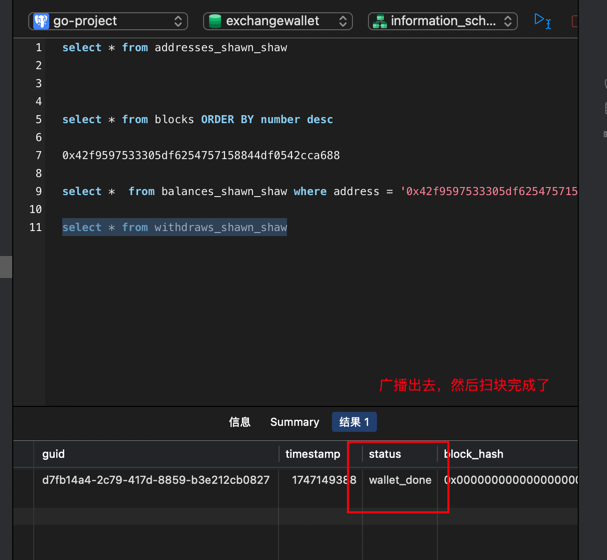
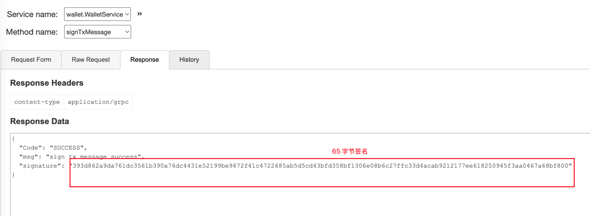
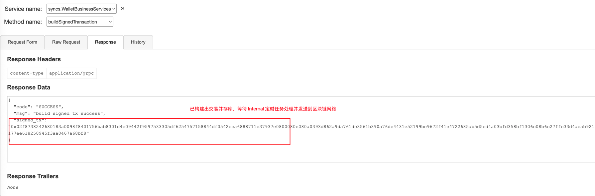
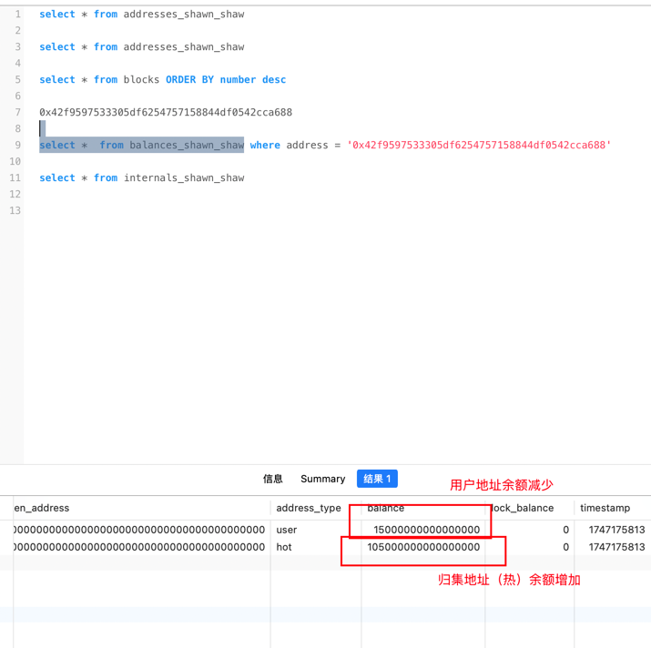

## 1. RPC 服务接口测试

- **业务方注册**：
    1. 业务方携带自己的 `requestId` 进行注册，系统会根据 `requestId` 为其生成独立的 `address`、`balance`、`transactions`、`deposits`、`withdraw`、`internal`、`tokens` 表
    2. 注册成功后，其所有业务都需要携带 `requestId` 进行请求，数据独立在其自己的表中。
    ```
  	BusinessRegister(context.Context, *BusinessRegisterRequest) (*BusinessRegisterResponse, error)
   ```
- **批量导出地址**：
    1. 业务方通过 “`signature-machine`” 项目（项目方自己部署，自己掌控私钥和签名流程）批量生成公钥，将公钥传入此接口，批量获取地址。
    2. 此接口中，会根据用户方传入的地址类型，保存该地址信息到 `address_{requestId}` 表中,并初始化 `balances`
    ```
  	ExportAddressesByPublicKeys(context.Context, *ExportAddressesRequest) (*ExportAddressesResponse, error)
  ```
- **构建未签名交易**：
    1. 在此接口中，业务方传入关键参数：`from`、`to`、`amount`、`chainId` 等信息，调用该接口。该接口会调用 “`chains-union-rpc`” 项目去获取地址的 `nonce`、`gasFee` 等。
    2. 然后构建 `EIP-1159` 的交易，调用 “`chains-union-rpc`” 项目去构建交易，返回 `16` 进制的未签名交易 `messageHash`（`32` 字节）、将交易信息保存在表中。返回 `messageHash` 和请求的 `transactionId`
    ```
      BuildUnSignTransaction(context.Context, *UnSignTransactionRequest) (*UnSignTransactionResponse, error)
  ```
- **构建已签名交易**：
    1. 项目方持有上述的未签名交易的 `messageHash`，调用 “`signature-machine`” 使用该交易对应的 `from` 地址私钥进行对此 `messageHash` 签名，返回 `signature` （`65` 字节） 信息
    2. 项目方拿到 `signature`、`transactionId`。 由 `transactionId` 从表中查出这笔交易，然后重新构造出来相同交易。调用 “`chains-union-rpc`” 的构建已签名接口，使用 `signature` 和 原交易信息发起调用 `BuildSignedTransaction`接口。
    3. 在“`chains-union-rpc`”中，会将 `signature` 拆分出 `r、s、v` 值和原交易组合起来，格式化返回一个已签名的交易（`16` 进制，`base64` 编码）
    4. 在拿到这个已签名交易的 `16` 进制数据后，即可调用 “`chains-union-rpc`” 里面的 `sendTx` 接口，将这笔交易公布到 `rpc` 网络中即可
    ```
  	BuildSignedTransaction(context.Context, *SignedTransactionRequest) (*SignedTransactionResponse, error)
  ```
  
- **联调** `exchange-wallet-service`、`signature-machine`、 `chains-union-rpc` **三个项目**
    1. exchange-wallet-service 业务方注册

  
  

    2. signature-machine 批量公钥生成

  
  

    3. exchange-wallet-service 公钥转地址

  
  

    4. 转资金进这个地址

  

    5. exchange-wallet-service 构建未签名交易

  
  

    6. signature-machine 中签名操作

  
  

    7. exchange-wallet-service 构建已签名交易

  
  

    8. chains-union-rpc 发送出去交易

  
  

    9. holesky 区块浏览器中查看这笔交易

  

## 2. 扫链同步器（生产者）扫块测试
- 启动扫链同步器服务


## 3. 交易发现器（消费者）、充值业务测试
1. 启动之前余额


2. 转入资金


3. 运行 ./exchange-wallet-service work


4. 启动之后余额（等待确认位之后（10 个块））


## 4. 提现测试

1. 签名机生成秘钥对
  生成一个热钱包地址去使用


2. 注册进钱包业务
  将这个热钱包地址注册进交易所业务层中


  
3. 转钱给热钱包地址
  先给这个热钱包地址一点资金，作为提现所用


4. 手动修改数据库余额（模拟归集后热钱包有钱）
  因为不是在交易所钱包业务中归集的，所以需要手动改一下库用于测试


5. 构建一笔未签名交易
  调用交易所钱包业务的构建未签名交易接口


  
6. 签名这笔交易
  将未签名交易的 messageHash 交给签名机离线签名


7. 检查余额、提现记录
  先检查下交易还未发送之前的热钱包余额和提现记录情况，方便后续发出交易后对比


8. 构建已签名交易，等待发起
  调用钱包层已经签名交易的接口，钱包层收到后，定时任务会发现这笔交易已签名，调用发送交易发送到区块链
  网络上（交易状态为已广播）然后交易同步器、发现器发现这笔提现交易后，即修改交易状态为（完成）


9. 等待交易发出、扫块发现
  检查数据库中提现记录，发现提现交易已完成。再检查余额记录，发现 0.02 ETH 已被成功扣除。



### 5. 归集测试

1. 构建未签名交易


2. 签名机签名



3. 构建已签名交易




4. 归集前余额


5. 启动同步器、发现器、内部交易定时任务后查看余额变化



### 6. 热转冷测试
1. 交易构建和签名过程和之前的测试一样，这里省略...

2. 热转冷前的余额


3. 热转冷后的余额


### 7. 冷转热测试
1. 交易构建和签名过程和之前的测试一样，这里省略...

2. 冷转热之前的余额


3. 冷转热之后的余额


### 8. 回滚测试
1. 修改数据库，模拟区块发生回滚，区块 hash 不正确


2. 在不连续的区块上，伪造一笔交易，测试回滚


2. 回滚之前的 transaction 流水表、balance 余额表


3. 回滚之后的 blocks 表、reorgBlocks表、流水表、余额表
   
   
   
   

### 9. 通知业务测试
1. 写个程序用于模拟项目方（钱包层）接收通知
```go
type NotifyRequest struct {
	Txn []httpclient.Transaction `json:"txn"`
}

func main() {
	http.HandleFunc("/exchange-wallet/notify", func(w http.ResponseWriter, r *http.Request) {
		log.Println("📩 Received a request")

		body, err := io.ReadAll(r.Body)
		if err != nil {
			http.Error(w, "failed to read body", http.StatusInternalServerError)
			return
		}
		defer r.Body.Close()

		var req NotifyRequest
		if err := json.Unmarshal(body, &req); err != nil {
			http.Error(w, "invalid JSON", http.StatusBadRequest)
			log.Println("❌ Invalid JSON:", err)
			return
		}

		// 打印格式化的 JSON
		fmt.Println("🧾 Parsed JSON request:")
		pretty, _ := json.MarshalIndent(req, "", "  ")
		fmt.Println(string(pretty))

		w.Header().Set("Content-Type", "application/json")
		w.Write([]byte(`{"success":true}`))
	})

	addr := "127.0.0.1:9997/exchange-wallet/notify"
	log.Println("🚀 Mock Notify Server listening on", addr)
	if err := http.ListenAndServe("127.0.0.1:9997", nil); err != nil {
		log.Fatal("❌ Server failed:", err)
	}
}

```
2. 启动这个模拟程序
   
3. 充值一笔试试，等待 10 个确认位
   